**SQL中Case的语法**

# case两种格式：

- 简单Case函数
    
    CASE sex
    
    WHEN '1' THEN '男'
    
    WHEN '2'THEN '女'
    
    ELSE '其他' END
- **Case搜索函数**
    
    CASE WHEN sex='1' THEN '男'
    
    WHEN sex='2'THEN '女'
    
    ELSE '其他' END
- 注意：
    

1. Case函数只返回第一个符合条件的值，剩下的Case部分将会自动忽略
    
    例如：CASE WHEN col\_1 IN ('a','b') THEN '第一类'
    
    WHEN col\_1 IN('a') THEN '第二类'
    
    ELSE '其他' END
2. case when:
    
    case(switch)里的那个when必须是数值型的
    

# Case函数用途：

## 已知数据按照另外一种方式分组：

- **根据这个国家人口数据，统计亚洲和北美洲的人口数量。**
    

1. 国家表结构（Table\_A）:
    

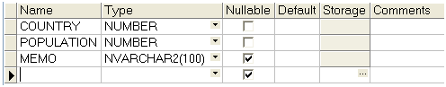

1. 表中数据：
    
    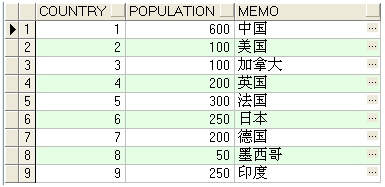
2. Sql代码（case1.sql）：
    

SELECT SUM(population),

CASE country

WHEN 1 THEN '亚洲'

WHEN 9 THEN '亚洲'

WHEN 6 THEN '亚洲'

WHEN 2 THEN '北美洲'

WHEN 3 THEN '北美洲'

WHEN 8 THEN '北美洲'

ELSE '其他' END

FROM Table\_A

GROUP BY CASE country

WHEN 1 THEN '亚洲'

WHEN 9 THEN '亚洲'

WHEN 6 THEN '亚洲'

WHEN 2 THEN '北美洲'

WHEN 3 THEN '北美洲'

WHEN 8 THEN '北美洲'

ELSE '其他' END;

1. 结果：
    
    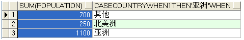

- **根据工资来判断等级，并统计每一等级的人数。**
    

1. 工资表结构（Table\_B）:
    

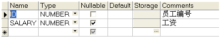

1. 表中数据：
    

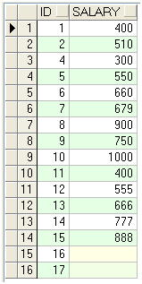

1. Sql代码（case2.sql）：
    

select

case when salary<=500 then '1'

when salary>500 and salary<=600 then '2'

when salary>600 and salary<=800 then '3'

when salary>800 and salary<=1000 then '4'

else null end salay\_class,

count(\*)

from Table\_B

group by

case when salary<=500 then '1'

when salary>500 and salary<=600 then '2'

when salary>600 and salary<=800 then '3'

when salary>800 and salary<=1000 then '4'

else null end;

1. 结果：
    

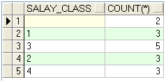

## 用一个SQL语句完成不同条件的分组：

1. 国家性别表结构（Table\_C）:
    
    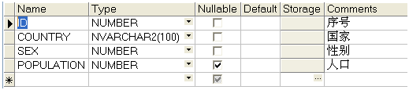
2. 表中数据：
    
    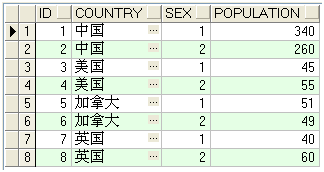
3. Sql代码（case3.sql）：
    

select country,

SUM(case when sex='1' then

population else 0 end),_\---男性人口_

SUM(case when sex='2' then

population else 0 end)_\--女性人口_

from Table\_C

group by country;

1. 结果：
    
    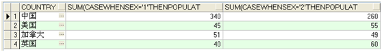

## 根据条件有选择的UPDATE：

- **例如：以如下条件更新**
    

1. 工资5000以上的职员，工资减少10%。
    
2. 工资在2000到4600之间的职员，工资增加15%
    
    1. 职员工资表：
        

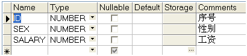

1. 表中数据：
    
    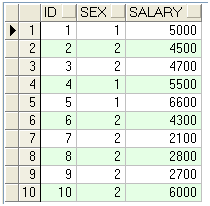
2. Sql代码（case4.sql）：
    

update Table\_D

set salary = case when salary>=5000

then salary\*0.9

when salary>=2000 and salary<4600

then salary\*1.15

else salary end;

1. 结果：
    

- **交换主键：**
    

1. 交换表结构（Table\_E）:
    
    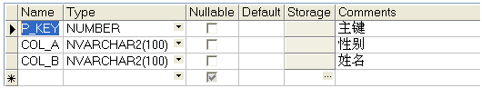
2. 表中数据：
    
    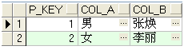
3. Sql代码（case5.sql）：
    

update TABLE\_E

set p\_key = case when p\_key=1

then 2

when p\_key=2

then 1

else p\_key end

where p\_key in (1,2);

1. 结果：
    
    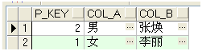

## 两个表数据是否一致的检查：

Case函数不同于DECODE函数。在Case函数中，可以使用BETWEEN,LIKE,IS,NULL,IN,EXISTS等等。比如说使用IN，EXISTS，可以进行子查询，从而实现更多的功能。

例子：

有两个表tab\_A,tab\_B，两个表中都有keyCol列。现在我们对这两个表进行比较，tab\_A中的keyCol列的数据如果再tab\_B的keyCol列的数据中可以找到，返回结果'Matcched'，如果没有找到，返回结果'Unmatched'。

1. 两个表的结构（tbl\_A,tbl\_B）
    
    Tbl\_A:
    
    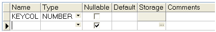
    
    Tbl\_B:
    
    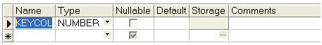
2. 表中数据：
    
    Tbl\_A:
    
    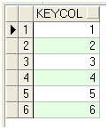
    
    Tbl\_B:
    
    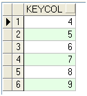
3. Sql代码：
    
    1. In代码（case6.sql）：
        

select keyCol,

case when keyCol in (select keyCol from tbl\_B)

then 'Matched'

else 'Unmatched' end Label

from tbl\_A;

1. Exists代码（case7.sql）：
    

select keyCol,

when exists (select \* from tbl\_B

where tbl\_A.Keycol=tbl\_B.Keycol)

then 'Matched'

else 'Unmatched' end Label

from tbl\_A;

1. 结果：
    
    1. In结果：
        
        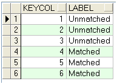
    2. Exists结果：
        
        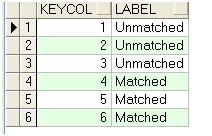

## 在Case函数中使用合计函数：

例题：有的学生选择了同时修几门课程（100，,200）也有的学生只选择了一门课程（300,400,500）。选修多门课程的学生，要选择一门课程作为主修，主修flag里面写入Y。只选择一门课程的学生，主修flag为N。

现在我们按照下面两个条件对这个表进行查询

1. 只选修一门课程的人，返回那门课程的ID
    
2. 选修多门课程的人，返货所选的主课程ID
    
    1. 学生—课程表结构（Studentclass）:
        
        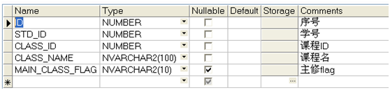
    2. 表中数据：
        
        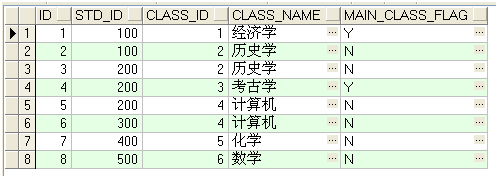
    3. Sql代码（case8.sql）：
        
    
    select std\_id,
    
    case when COUNT(\*)=1_\---只选择一门课程的学生的情况_
    
    then MAX(class\_id)
    
    else MAX(case when main\_class\_flag='Y'
    
    then class\_id
    
    else null end
    
    )
    
    end as main\_class
    
    from Studentclass
    

group by std\_id;

1. 结果：
    
    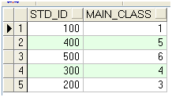
