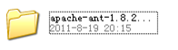
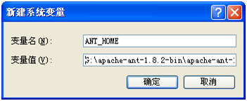
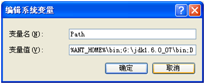
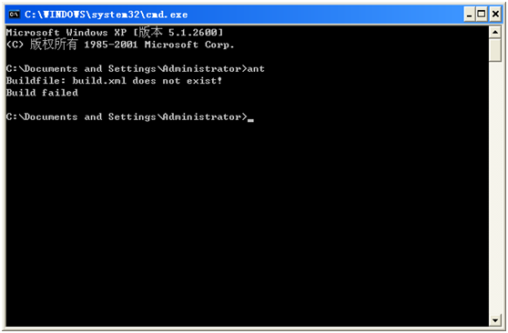
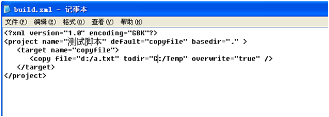
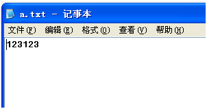
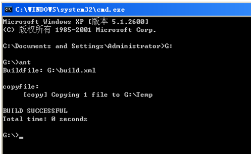
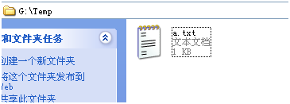
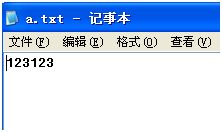

ANT安装和配置

- 下载地址：[http://ant.apache.org/bindownload.cgi](http://ant.apache.org/bindownload.cgi)
    
- [解压缩：](http://ant.apache.org/bindownload.cgi)
    
    
    
- [设置环境变量：](http://ant.apache.org/bindownload.cgi)
    
    [我的电脑--à属性-à高级--à环境变量：](http://ant.apache.org/bindownload.cgi)
    
    [ANT\_HOME:](http://ant.apache.org/bindownload.cgi)
    
    
    
    [Path：](http://ant.apache.org/bindownload.cgi)
    
    
    
- [测试是否安装成功：](http://ant.apache.org/bindownload.cgi)
    

[安装成功啦！](http://ant.apache.org/bindownload.cgi)

- [测试实例：](http://ant.apache.org/bindownload.cgi)
    
    [建立build.xml，建立在G盘（此位置随意）：](http://ant.apache.org/bindownload.cgi)
    
    [建立a.txt(程序中在d盘，所以此文件建立在D盘)：](http://ant.apache.org/bindownload.cgi)
    
    [.](http://ant.apache.org/bindownload.cgi)
    
    [打开命令行，进入G盘：](http://ant.apache.org/bindownload.cgi)
    
    
    
    [查看结果：](http://ant.apache.org/bindownload.cgi)
    
    [  
    内容和D盘中的a.txt相同：](http://ant.apache.org/bindownload.cgi)
    

