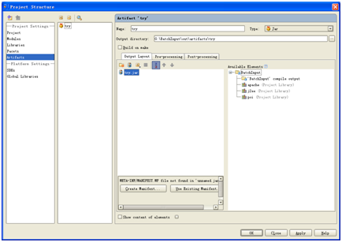
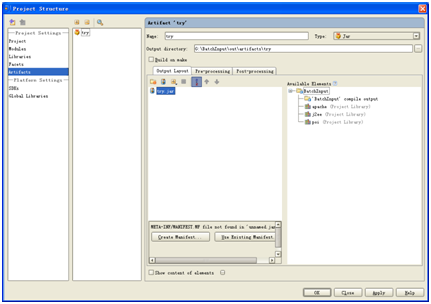
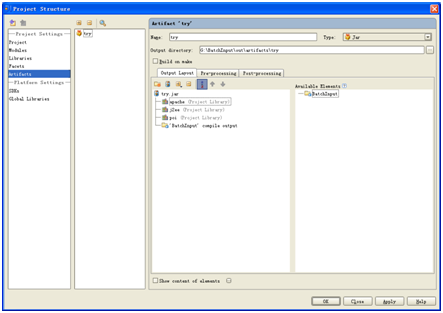
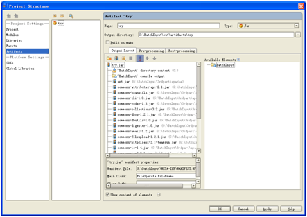
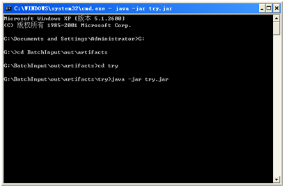

- Product Structure:
    

- 点击"+"，输入jar包的名字：
    

- 点击右侧的"+"号，把"Library File"和"Module Output"添加进来：
    

1. 在下面的"main-class"，选中主函数，如图：
    
    
    

- 点击"OK".
    
- 点击"Build"—>Build 'try' artifact.
    
- 查看项目根目录—>out-àartifact—>try文件下，找到try.jar
    
- 运行try.jar:
    

我的jar运行成功啦！
