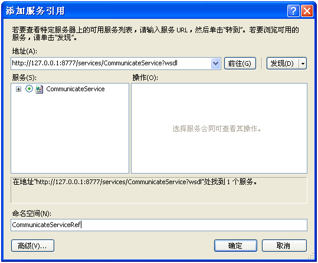
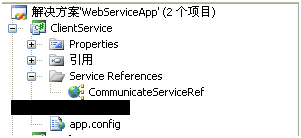

**Java Web Service的构建**

Web Service就是服务器端普通的Java代码，不過，要求有接口和他的实现。

[Web Service工程WebService4Freshman下载](https://www.zhouzhengxi.com/opensource/src/WebService4Freshman.zip)   (工程WebService4Freshman的jar包有些不是必需的)

- 接口IHelloWorld.java

**package** info.momoyi.webservice;

 

**import** javax.jws.WebService;

 

/\*\*

\***@Name**:

\***@Date**:Aug 21, 2011 9:01:32 PM

\***@TODO**:注意，对于WebService而言，接口必须写 注意断言 WebService

\*/

@WebService

**public** **interface** IHelloWorld {

 **public** String sayHello(String name);

 

}

 

- 实现HelloWorld.java

**package** info.momoyi.webservice;

 

**import** javax.jws.WebService;

 

/\*\*

\***@Name**:will

\***@Date**:Aug 21, 2011 9:03:04 PM

\***@TODO**:接口的实现类 注意断言的写法

\*

\*注意：serviceName \= "CommunicateService"对应下面config.xml的<service name="CommunicateService">

\*/

 

@WebService(serviceName = "CommunicateService", endpointInterface = "info.momoyi.webservice.IHelloWorld")

**public** **class** HelloWorld **implements** IHelloWorld{

 **public** String sayHello(String name){

 **return** "Hello, "+name;

 }

}

- Spring的配置applicationContext.xml

<?xml version\="1.0" encoding\="UTF-8"?>

<beans xmlns\="http://www.springframework.org/schema/beans"

 xmlns:xsi\="http://www.w3.org/2001/XMLSchema-instance"

 xmlns:aop\="http://www.springframework.org/schema/aop"

 xmlns:tx\="http://www.springframework.org/schema/tx"

 xsi:schemaLocation\="http://www.springframework.org/schema/beans

 http://www.springframework.org/schema/beans/spring-beans-2.5.xsd

 http://www.springframework.org/schema/tx

http://www.springframework.org/schema/tx/spring-tx.xsd

 http://www.springframework.org/schema/aop

 http://www.springframework.org/schema/aop/spring-aop-2.0.xsd"\>

 <bean id\="communicateService"

 class\="info.momoyi.webservice.HelloWorld"\>

 </bean\>

</beans\>

注意：

后面config.xml的配置<spring-object bean="communicateService" />对应bean id="communicateService"

- config.xml的配置
    

<?xml version\="1.0" encoding\="UTF-8"?>

<mule xmlns\="http://www.mulesource.org/schema/mule/core/2.2"

 xmlns:context\="http://www.springframework.org/schema/context"

 xmlns:jee\="http://www.springframework.org/schema/jee"

 xmlns:xsi\="http://www.w3.org/2001/XMLSchema-instance"

 xmlns:spring\="http://www.springframework.org/schema/beans"

 xmlns:vm\="http://www.mulesource.org/schema/mule/vm/2.2"

 xmlns:ejb\="http://www.mulesource.org/schema/mule/ejb/2.2"

 xmlns:jms\="http://www.mulesource.org/schema/mule/jms/2.2"

 xsi:schemaLocation\="

http://www.springframework.org/schema/beans http://www.springframework.org/schema/beans/spring-beans-2.5.xsd

http://www.springframework.org/schema/jee http://www.springframework.org/schema/jee/spring-jee-2.5.xsd

http://www.springframework.org/schema/context http://www.springframework.org/schema/context/spring-context-2.5.xsd

http://www.mulesource.org/schema/mule/core/2.2 http://www.mulesource.org/schema/mule/core/2.2/mule.xsd

http://www.mulesource.org/schema/mule/vm/2.2 http://www.mulesource.org/schema/mule/vm/2.2/mule-vm.xsd

http://www.mulesource.org/schema/mule/ejb/2.2 http://www.mulesource.org/schema/mule/ejb/2.2/mule-ejb.xsd

http://www.mulesource.org/schema/mule/jms/2.2 http://www.mulesource.org/schema/mule/jms/2.2/mule-jms.xsd"\>

 <spring:beans\>

 <spring:import resource\="classpath:applicationContext.xml" /> 

 </spring:beans\>

 <model name\="manage"\>

 <service name\="CommunicateService"\>

 <inbound\>

 <!-- Public interface -->

 <inbound-endpoint

 address\="cxf:http://0.0.0.0:8777/services/CommunicateService" />

 </inbound\>

 <component\>

 <spring-object bean\="communicateService" />

 </component\>

 </service\>

 </model\> 

</mule\>

注意：

<model name\="manage"\> manage可以随便写

<inbound-endpoint address\="cxf:http://0.0.0.0:8777/services/CommunicateService" /> CommunicateService可以随便写

- web.xml的配置
    

<?xml version\="1.0" encoding\="UTF-8"?>

<web-app id\="WebApp\_ID" version\="2.4"

 xmlns\="http://java.sun.com/xml/ns/j2ee"

 xmlns:xsi\="http://www.w3.org/2001/XMLSchema-instance"

 xsi:schemaLocation\="http://java.sun.com/xml/ns/j2ee http://java.sun.com/xml/ns/j2ee/web-app\_2\_4.xsd"\>

 <display-name\>Bookstore Administration</display-name\>

 <description\>

 Administration console for the Mule-powered On-line Bookstore

 </description\>

 

 <!-- 读取config.xml的配置 -->

 <context-param\>

 <param-name\>org.mule.config</param-name\>

 <param-value\>/WEB-INF/config.xml</param-value\>

 </context-param\> 

 

 

 <!-- This listener will start up Mule inside the webapp -->

 <listener\>

 <listener-class\>

 org.mule.config.builders.MuleXmlBuilderContextListener

 </listener-class\>

 

 </listener\>

 

 <servlet\>

 <servlet-name\>muleServlet</servlet-name\>

 <servlet-class\>

 org.mule.transport.servlet.MuleRESTReceiverServlet

 </servlet-class\>

 

 <!-- Responses from the servlet are of type HTML by default -->

 <init-param\>

 <param-name\>

 org.mule.servlet.default.content.type

 </param-name\>

 <param-value\>text/html</param-value\>

 </init-param\>

 </servlet\>

 

 

 <servlet-mapping\>

 <servlet-name\>muleServlet</servlet-name\>

 <url-pattern\>/services/\*</url-pattern\>

 </servlet-mapping\>

 

 

 <welcome-file-list\>

 <welcome-file\>index.jsp</welcome-file\>

 </welcome-file-list\>

</web-app\>

**C#引用Web Service**

[C#引用Web Service的解决方案下载](https://www.zhouzhengxi.com/opensource/src/WebServiceApp.zip)

- 建立解决方案WebServiceApp
    
- 建立类库ClientService
    

添加服务引用

生成下图代码

- 在类库ClientService下建立类CommunicateService.cs封装被引用的服务
    

using System;

using System.Collections.Generic;

using System.Text;

using ClientService;

using ClientService.CommunicateServiceRef;

 

namespace ClientService.Serivces

{

public class CommunicateService

{

public String Hello(String name){

CommunicateServiceRef.HelloWorldClient client = new HelloWorldClient();

return client.sayHello(name);

}

}

}

- 建立Windows 窗体用户界面的应用程序的项目WebServiceApp调用被封装的应用
    

注意，将ClientService下生成的app.config拷贝到WebServiceApp项目下

Program.cs

using System;

using System.Collections.Generic;

using System.Linq;

using System.Windows.Forms;

using ClientService.Serivces;

namespace WebServiceApp

{

static class Program

{

/// 

/// 应用程序的主入口点。

/// 

\[STAThread\]

static void Main()

{

CommunicateService service = new CommunicateService();

Console.WriteLine(service.Hello("kitty"));

}

}

}
