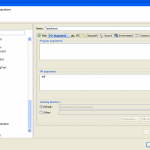

package info.momoyi.test20111101;

/\*\*
 \*@Name:周正喜
 \*@Date:Nov 1, 2011 3:39:38 PM
 \*@Function:断言
 \*/
public class TestAssert {
	public TestAssert(){}

	public static void main(String args\[\]){
		int x  = 10;		
		assert x == 11:"断言!";			
	}
}

开启MyEclipse对断言的支持

