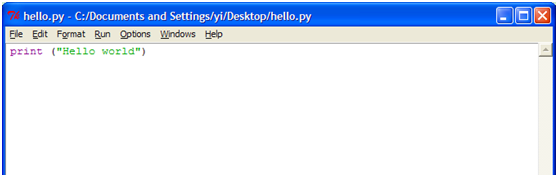

## 下载

- Python官网：[http://www.python.org/](http://www.python.org/)
    
- Python下载地址：http://www.python.org/getit/
    

## 安装

- 双击"python-3.2.1.msi"：
    
    
    
- 根据安装向导安装：
    
- 安装成功：
    

## 第一个python例子

- 打开IDLE(Python GUI)：
    
    
    
- 点击"File"à"New Window"：
    
    
    
- 输入第一个例子的代码：
    
    
    
- 点击"Run"à"Run Module"：
    
    
