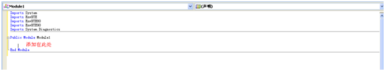
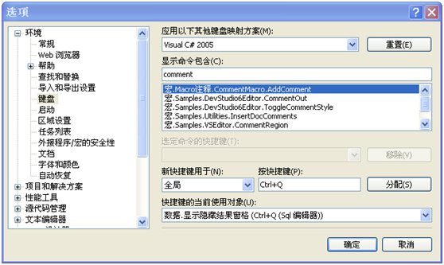
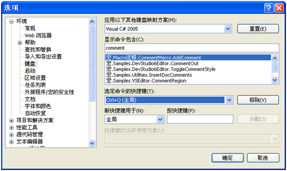
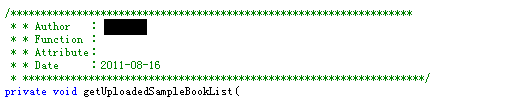

1. 打开Visual Studio开发工具，单击"工具→宏→新建宏项目"，然后按照步骤建立注释宏，添加如下代码并保存。

Sub AddComment()

Dim DocSel As EnvDTE.TextSelection

DocSel = DTE.ActiveDocument.Selection

DocSel.NewLine()

DocSel.Text = "/\*\*\*\*\*\*\*\*\*\*\*\*\*\*\*\*\*\*\*\*\*\*\*\*\*\*\*\*\*\*\*\*\*\*\*\*\*\*\*\*\*\*\*\*\*\*\*\*\*\*\*\*\*\*\*\*\*\*\*\*\*\*\*\*\*\*\*"

DocSel.NewLine()

DocSel.Text = "\* Author ：踮起脚尖"

DocSel.NewLine()

DocSel.Text = "\* Function ："

DocSel.NewLine()

DocSel.Text = "\* Attribute："

DocSel.NewLine()

DocSel.Text = "\* Date ：" + System.DateTime.Now.ToLongDateString()

DocSel.NewLine()

DocSel.Text = "\*\*\*\*\*\*\*\*\*\*\*\*\*\*\*\*\*\*\*\*\*\*\*\*\*\*\*\*\*\*\*\*\*\*\*\*\*\*\*\*\*\*\*\*\*\*\*\*\*\*\*\*\*\*\*\*\*\*\*\*\*\*\*\*\*\*\*/"

End Sub

 

1. 打开 菜单 –> 工具–>选项 –> 键盘 ，在列表框中选择刚才添加的Macro，然后在 按快捷键中输入快捷键，
    
    点击"分配" 。 
    
    
2. 效果
    
    按键：CTRL+
    
    

参考：[http://www.cnblogs.com/tanky\_woo/archive/2011/01/28/1946816.html](http://www.cnblogs.com/tanky_woo/archive/2011/01/28/1946816.html)
