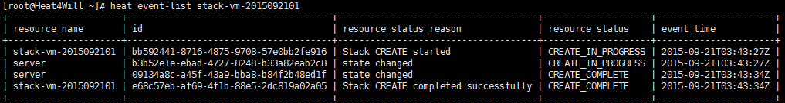
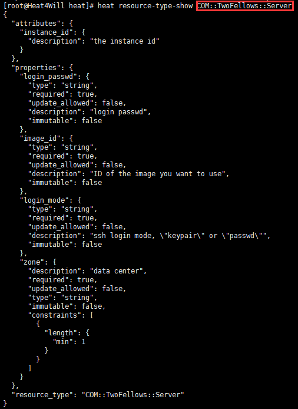

**Heat resource plug-in 开发 —— OpenStack Heat从入门到实践**

Heat resource是什么？通过命令“heat resource-type-list”，我们可以略窥一二。

橙色部分是Heat自带的一些resource type，红色部分是我们自己开发的resource type（如果开发工作还没开始，则不会显示）。更准确的说，Heat resource type是以XXX::YYY::ZZZ标志的，一个继承了heat.engine.resource.Resource的Python类，该类可以扩展加强Heat本身的服务。

下面以[https://github.com/zzxwill/Heat4CloudProviders/blob/master/qingcloud\_heat\_plugin/resources/server.py](https://github.com/zzxwill/Heat4CloudProviders/blob/master/qingcloud_heat_plugin/resources/server.py)为例，说明resource type COM::TwoFellows::Server。该resource type用来创建、更新、删除一个虚拟机。

方法 def handle\_create(self)用来创建resource type，具体而言，是通过方法run\_instances(）调用青云的API，在青云的云平台上创建一个虚拟机。

 ret = conn.run\_instances(               image\_id=qingcloud\_image\_id,cpu=1,

memory=1024,

#vxnets=\['vxnet-0'\],

login\_mode= qingcloud\_login\_mode,

 login\_passwd= qingcloud\_login\_passwd)

方法 def check\_create\_complete(self, token)用来检查虚拟机是否创建成功，具体而言，是通过方法describe\_instances（）调用青云的API，检查主机的创建状态。如果主机创建成功，则返回Ture, 标记stack的状态为“CREATE\_COMPLETE”；如果主机创建不成功，则返回False, 标记stack的状态为“CREATE\_FAILED”。

关于如何写handle\_create()和check\_create\_complete（），我会在后面介绍。下面直观的感受一下通过创建stack来创建resource。

执行命令heat stack-create stack-vm-2015092101 -f /usr/lib/heat/qingcloud\_heat\_plugin/template/qingcloud\_vm\_stack.yaml

等一会儿，检查stack状态，stack已经创建成功了。

同时，可以看到一个主机在青云上已经创建好了。

resource type的详情如下。

我们发现，resource type详情中的perperties和attributes跟上节讲到的HOT十分相关。下篇，我们将讲到这个问题。

更多《OpenStack Heat从入门到实践》系列文章，请关注

1）博客：[https://www.zhouzhengxi.com/wordpress/tag/Heat/](https://www.zhouzhengxi.com/wordpress/tag/Heat/)。

2）微信公众账号，Geek2014。

