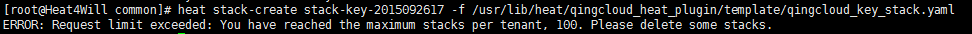

**ERROR: Request limit exceeded: You have reached the maximum stacks per tenant, 100. ——OpenStack Heat从入门到实践**

默认情况下，创建的stack个数为100，继续创建会出现如下错误。

ERROR: Request limit exceeded: You have reached the maximum stacks per tenant, 100. Please delete some stacks.

如果你跟我一样懒，不想一个一个删除，可以增大每个tenant允许的最大stack数目。

1\. 增大/usr/lib/python2.7/site-packages/heat/common/config.py的max\_stacks\_per\_tenant值。

 cfg.IntOpt('max\_stacks\_per\_tenant',

 default=**100**,

 help=\_('Maximum number of stacks any one tenant may have'

 ' active at one time.')),

2\. 重启heat engine

systemctl restart openstack-heat-engine.service openstack-heat-api.service  openstack-heat-api-cfn.service

3\. 继续运行heat stack-create

更多《OpenStack Heat从入门到实践》系列文章，请关注

1）博客：[https://www.zhouzhengxi.com/wordpress/tag/Heat/](https://www.zhouzhengxi.com/wordpress/tag/Heat/)。

2）微信公众账号，Geek2014。

ERROR: Request limit exceeded: You have reached the maximum stacks per tenant, 100. Please delete some stacks.
