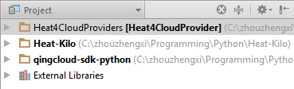
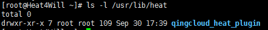
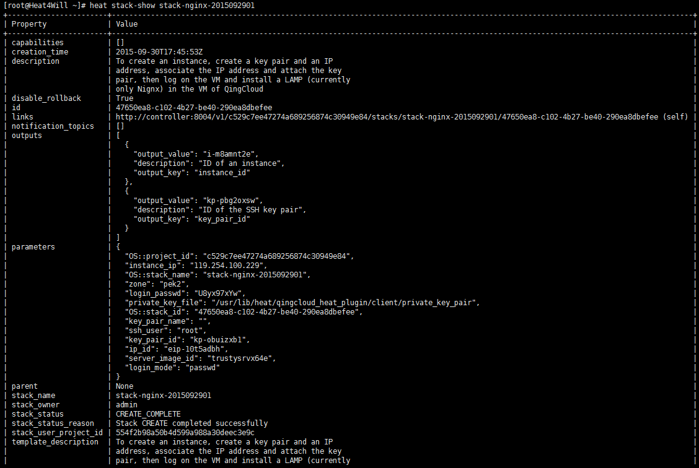

我在GitHub上这样介绍Heat4CloudProviders这个开源项目：

Heat4CloudProviders is an OpenStack Heat solution for Chinese IaaS Cloud Providers, like QingCloud and Meituan Cloud, to make services deployment much more automatically and simply, without any manual steps in the console of these Cloud Service providers.

具体而言，Heat4CloudProviders是一个OpenStack Heat Resource Type Plugin，并且Heat4CloudProviders v1.0这个版本实现的是QingCloud IaaS资源的部署。那么，Heat4CloudProviders依赖Heat的基本环境和QingCloud SDK。

快速部署本项目，请参考以下步骤。

0\. 准备一台云服务器

什么？你还在使用不方便访问的物理服务器/主机？甚至在VMWare或Oracle VM里部署Linux Server？那快快了解下云主机，请参考这篇文章

[Top5云主机一线体验报告(国内篇)](http://mp.weixin.qq.com/s?__biz=MjM5NDI3OTUwNg==&amp;mid=206565584&amp;idx=1&amp;sn=5675792a37a7808726fe7cf8d2bab41d&amp;3rd=MzA3MDU4NTYzMw==&amp;scene=6#rd)

感谢[美团云](https://mos.meituan.com/)为本开源项目提供了两台云主机，我在云主机上部署了CentOS 7 server。

**1\. 搭建OpenStack Heat （Kilo Edition）开发环境**

1）服务器

安装了CentOS 7的云主机让我得以快速高效地访问开发环境，基于OpenStack Heat官方安装文档 ，我部署了最新版本（Kilo）的OpenStack Heat开发环境。

该文档地址为：

[OPENSTACK INSTALLATION GUIDE FOR RED HAT ENTERPRISE LINUX 7, CENTOS 7, AND FEDORA 21  - KILO](http://docs.openstack.org/kilo/install-guide/install/yum/content/index.html)

建议各位如果有时间，也手动去部署Heat，这对理解Heat架构很有帮助。

2）本地开发环境

直接通过git下载OpenStack Heat (Kilo) source code。

**2\. 准备QingCloud SDK**

1）服务器

建议大家通过QingCloud SDK github页面指导安装SDK， [https://github.com/zzxwill/qingcloud-sdk-python](https://github.com/zzxwill/qingcloud-sdk-python)。

2）本地开发环境

我是直接通过QingCloud的git url，将SDK导入到PyCharm里的，这么做的原因是a) 便于很简单的IDE里获取最新的SDK Code b）Windows 7 Python开发环境里安装了SDK for Python的package之后，PyCharm里的Python代码还是无法引用到SDK的module。

最后本地开发环境的代码结构如下。

3\. 运行Heat4CloudProviders (Heat Resource Type Plugin)工程

跟一般的Heat Resource Type Plugin一样，可以将 [qingcloud\_heat\_plugin](https://github.com/zzxwill/Heat4CloudProviders/tree/master/qingcloud_heat_plugin "qingcloud_heat_plugin")放到/usr/lib/heat/下。

qingcloud\_heat\_plugin下resources以外的目录下的module并没有继承Heat Resource类heat.engine.resource，为了能让plugin引用，需要在/usr/lib/python2.7/site-packages创建一个.pth文件，写明其他目录下module的路径。

运行如下命令，创建如下资源。

provision an instancecreate a SSH key pair

attach public SSH key to the instance

associate an public IP to the instance

log on the instance via SSH private key

install and start NginX in the instance

\[root@Heat4Will ~\]# source /root/admin-openrc.sh

\[root@Heat4Will ~\]# heat stack-create stack-nginx-2015092901 -e /usr/lib/heat/qingcloud\_heat\_plugin/template/qingcloud\_env.yaml -f /usr/lib/heat/qingcloud\_heat\_plugin/template/qingcloud\_NGINX.yaml

通过stack-show查看公网IP。

访问[http://119.254.100.229/](http://119.254.100.229/)，发现Nginx已经成功安装。

