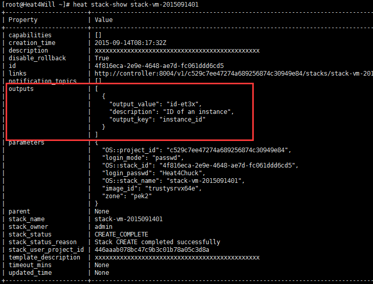

**水乳交融的HOT和Resource type Python类 —— OpenStack Heat从入门到实践**

HOT的YAML文件：[https://github.com/zzxwill/Heat4CloudProviders/blob/master/qingcloud\_heat\_plugin/template/qingcloud\_vm\_stack.yaml](https://github.com/zzxwill/Heat4CloudProviders/blob/master/qingcloud_heat_plugin/template/qingcloud_vm_stack.yaml)

Heat Resource type Python类：[https://github.com/zzxwill/Heat4CloudProviders/blob/master/qingcloud\_heat\_plugin/resources/server.py](https://github.com/zzxwill/Heat4CloudProviders/blob/master/qingcloud_heat_plugin/resources/server.py)

**1\. YAML和Python类是怎么关联起来的？**

创建一个虚拟机的命令是heat stack-create stack-vm-2015092101 -f /usr/lib/heat/qingcloud\_heat\_plugin/template/qingcloud\_vm\_stack.yaml

这个Heat命令是调用Python类server.py。那YAML和Python类是怎么关联起来的呢？

YAML里定义的resource type是“ COM::TwoFellows::Server”，Python里有如下mapping。

即“ COM::TwoFellows::Server” mapping到了QingCloudServer类，而这个类，正好就是server.py。

这样，-f后面YAML就能够指定由那个Python类来执行操作。

**2\. YAML怎么传值给Python类？**

这里的properties是指类QingCloudServer，该类的properties image\_id通过get\_param获取YAML里parameters里的server\_image\_id

模板里的parameter server\_image\_id的值trustysrvx64e会根据如下定义“get\_param”

传递给properties\_schema里的IMAGE\_ID.

IMAGE\_ID表示'image\_id'

然后，通过self.perperties\[\]获取到YAML模板的传值。

总结：YAML里的parameters根据get\_param将值传递给resource class的properties。

3\. Python类是怎么给YAML传值的？

使用stack-show命令可以查看resource的outputs。

outputs输出那些，是由YAML决定的。

instance\_id的值是从server的attribute instance\_id获取的。

server是什么？—— resource type COM::TwoFellows::Server的别称。

具体的获取方式，是由QingCloudServer类的方法\_resolve\_attribute决定的。

总结：resource type的outputs是由YAML模板决定，根据resource type的\_resolve\_attribute()获取后，通过get\_attr传递给resource type。

这样，HOT和Resource type Python类水乳交融的关系就里清了。

更多《OpenStack Heat从入门到实践》系列文章，请关注

1）博客：[https://www.zhouzhengxi.com/wordpress/tag/Heat/](https://www.zhouzhengxi.com/wordpress/tag/Heat/)。

2）微信公众账号，Geek2014。

