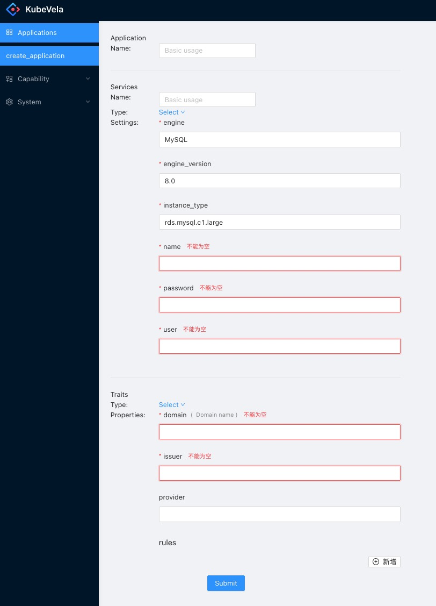

# 写了两天 React

Posted on Feb 5 2021

---

KubeVela 项目的前端资源突然没了，不得不怀着忐忑的心情下场写前端代码，主要是 React(TypeScript) 和 AntD，记录一下学到的一些知识。

## React

- if/else

```typescript
if (capabilityType === 'workload_type') {
    setWorkloadSchema(data);
} else if (capabilityType === 'trait') {
    setTraitSchema(data);
}
```

`===` 表示 `==`

- string to json

```typescript
const data = JSON.parse(result.data);
```

- debug

可以用浏览器开发则模式，或者打印。

```typescript
console.log(xxx)
```

- click 事件

```typescript
<Menu.Item
      key={i.name}
      icon={<UserOutlined />}
      onClick={() => handleMenuClick('workload_type', i.name)}
    >
      {i.name}
    </Menu.Item>

function handleMenuClick(capabilityType: string, capabilityName: string) {
    console.log('click', capabilityName);
    getCapabilityOpenAPISchema(capabilityName).then((result) => {
        const data = JSON.parse(result.data);
        if (capabilityType === 'workload_type') {
            setWorkloadSchema(data);
        } else if (capabilityType === 'trait') {
            setTraitSchema(data);
        }
    });
}
```

- 循环

```typescript
const workloadMenuList = workloadList?.map((i) => (
    <Menu.Item
      key={i.name}
      icon={<UserOutlined />}
      onClick={() => handleMenuClick('workload_type', i.name)}
    >
      {i.name}
    </Menu.Item>
  ));

```

https://zh-hans.reactjs.org/docs/lists-and-keys.html#basic-list-component


## AntD

- 避免 AntD 样式不显示

```javascript
import 'antd/dist/antd.css';
```
- Layout 布局

盒子布局，每行等分 24 份，一学就明白。
https://010x.ant.design/components/layout/

从此再也不用学习 CSS 布局了。



- 组件

分割线
下拉列表：[Dropdown](https://ant.design/components/dropdown/)


