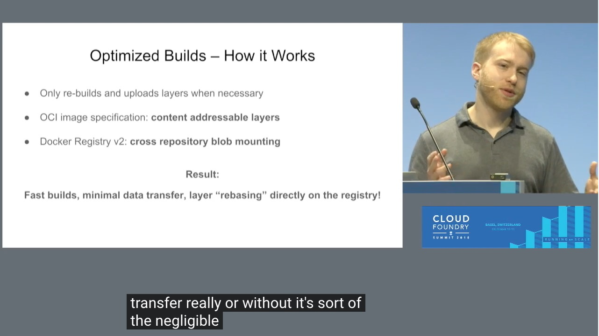
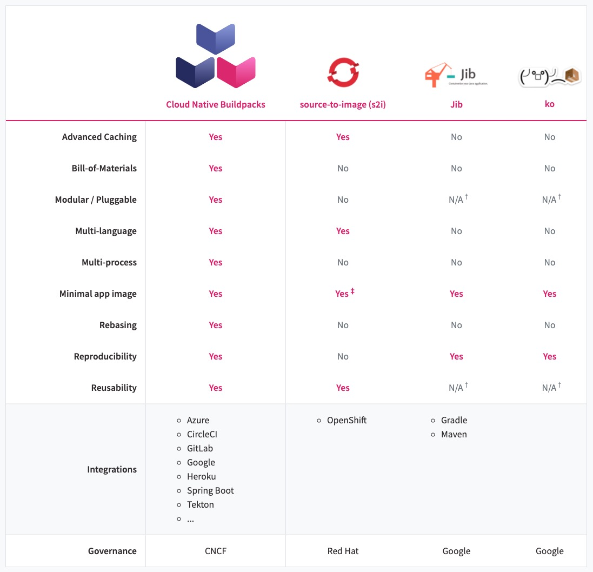

Posted at Feb 18 2021

---

## 要点

- Buildpacks 不生成 Dockerfile

Buildpacks 不生成 Dockerfile，Dockerfile 有一些弱势，比如 layer 分层不够，BuildPacks 利用
Docker Registry V2 的 cross repository blob mounting 特性，可以单独编译，更新特定的层。

- 核心步骤：detect + build

- 跟 Openshift 的 source-to-image, jib, ko 有啥区别

https://buildpacks.io/features/#comparison

## Reference

- [Buildpacks vs Dockerfile, why Buildpacks](https://www.youtube.com/watch?v=J6zn3WRqJko)
- [First look at Cloud Native Buildpacks support in Spring Boot 2.3 (Milestone 1](https://medium.com/@TimvanBaarsen/first-look-at-cloud-native-buildpacks-support-in-spring-boot-2-3-milestone-1-ece8e72ed93f)