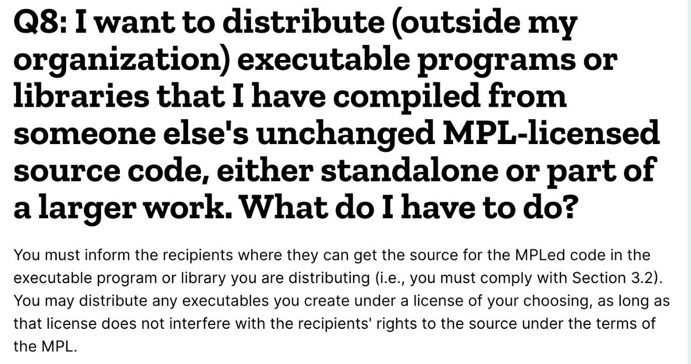

# 每天学一点-Kubernetes-048-kubernetes-license

Posted on May 20, 2021

---

License

Hashicorp 这家公司太牛逼了，他们 Mozilla Publice License 2.0 的库被 Kubernetes 广泛依赖。特别是 github.com/kubernetes/kubernetes 直接使用了 18 个库。

kubernetes、  apimachinary、client-go 、api 用了

https://github.com/kubernetes/kubernetes/blob/master/go.mod#L296-L313
https://github.com/kubernetes/apimachinery/blob/master/go.mod#L18
https://github.com/kubernetes/client-go/blob/master/go.sum#L133-L135
https://github.com/kubernetes/api/blob/master/go.sum#L60

https://www.mozilla.org/en-US/MPL/2.0/FAQ/

