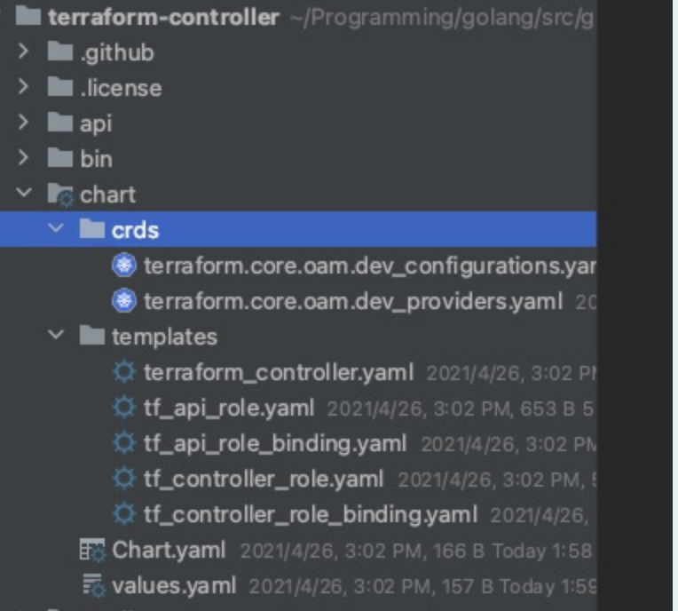

# 每天学一点-Kubernetes-050-make-chart-for-kubebuilder-project

Posted on May 30, 2021

---

Kubernetes Controller
chart 构建

Kubebuilder 生成的 k8s controller，如何生成 helm chart 没有合适的工具，需要自己构建。

其中，controller 需要读取的 cr 都需要设置 rbac

