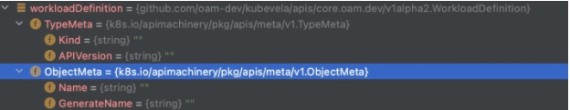

# 每天学一点-go-语言-077-该用哪个yaml库？

Posted on Mar 16 2021

---

```go
import "github.com/go-yaml/yaml"
err := yaml.Unmarshal([]byte(validWorkloadDefinition), &workloadDefinition)
```

拿不到 APIVersion Kind



`github.com/ghodss/yaml` 可以
