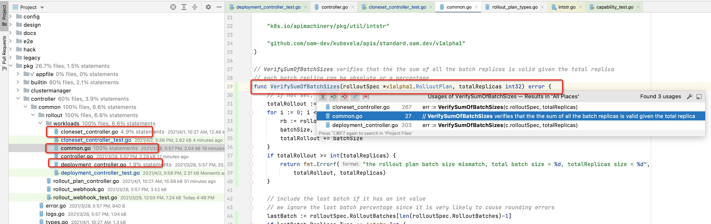

# 每天学一点-go-语言-092-单元测试

Posted on May 4, 2021

---
单元测试

ut 覆盖度

common.go 里的函数被 pkg/controller/common/rollout/workloads/deployment_controller.go 调用，写 deployment_controller.go 里的单元测试，也可以覆盖到 common.go
比如如图 100% 覆盖到了。

