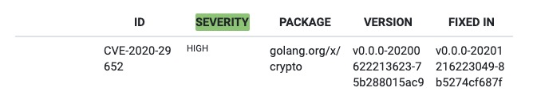

# 每天学一点-go-语言-105-dependency-of-libraries

Posted on Jun 21, 2021

---

依赖
某个包被依赖情况

```shell


➜  /Users/zhouzhengxi/Programming/golang/src/github.com/oam-dev/kubevela git:(cve-crypto) ✗ go mod graph | more
github.com/oam-dev/kubevela cuelang.org/go@v0.2.2
github.com/oam-dev/kubevela github.com/AlecAivazis/survey/v2@v2.1.1
github.com/oam-dev/kubevela github.com/Netflix/go-expect@v0.0.0-20180615182759-c93bf25de8e8
github.com/oam-dev/kubevela github.com/alecthomas/template@v0.0.0-20190718012654-fb15b899a751
github.com/oam-dev/kubevela github.com/aryann/difflib@v0.0.0-20210328193216-ff5ff6dc229b
github.com/oam-dev/kubevela github.com/bmizerany/assert@v0.0.0-20160611221934-b7ed37b82869
github.com/oam-dev/kubevela github.com/briandowns/spinner@v1.11.1
github.com/oam-dev/kubevela github.com/coreos/prometheus-operator@v0.41.1
github.com/oam-dev/kubevela github.com/crossplane/crossplane-runtime@v0.10.0
github.com/oam-dev/kubevela github.com/davecgh/go-spew@v1.1.1
github.com/oam-dev/kubevela github.com/deckarep/golang-set@v1.7.1
github.com/oam-dev/kubevela github.com/evanphx/json-patch@v4.9.0+incompatible
github.com/oam-dev/kubevela github.com/fatih/color@v1.9.0
github.com/oam-dev/kubevela github.com/gertd/go-pluralize@v0.1.7
github.com/oam-dev/kubevela github.com/getkin/kin-openapi@v0.34.0
github.com/oam-dev/kubevela github.com/ghodss/yaml@v1.0.0
github.com/oam-dev/kubevela github.com/gin-contrib/static@v0.0.0-20200815103939-31fb0c56a3d1
github.com/oam-dev/kubevela github.com/gin-gonic/gin@v1.6.3
github.com/oam-dev/kubevela github.com/go-logr/logr@v0.4.0
github.com/oam-dev/kubevela github.com/go-openapi/jsonreference@v0.19.5
github.com/oam-dev/kubevela github.com/go-openapi/spec@v0.19.8
github.com/oam-dev/kubevela github.com/go-openapi/swag@v0.19.11
github.com/oam-dev/kubevela github.com/go-playground/validator/v10@v10.4.1
github.com/oam-dev/kubevela github.com/google/go-cmp@v0.5.5
github.com/oam-dev/kubevela github.com/google/go-github/v32@v32.1.0
github.com/oam-dev/kubevela github.com/gosuri/uitable@v0.0.4
github.com/oam-dev/kubevela github.com/hashicorp/hcl/v2@v2.9.1
github.com/oam-dev/kubevela github.com/hinshun/vt10x@v0.0.0-20180616224451-1954e6464174
github.com/oam-dev/kubevela github.com/klauspost/compress@v1.10.5
github.com/oam-dev/kubevela github.com/kyokomi/emoji@v2.2.4+incompatible
github.com/oam-dev/kubevela github.com/mailru/easyjson@v0.7.6
github.com/oam-dev/kubevela github.com/mholt/archiver/v3@v3.3.0
github.com/oam-dev/kubevela github.com/mitchellh/hashstructure/v2@v2.0.1
github.com/oam-dev/kubevela github.com/oam-dev/terraform-config-inspect@v0.0.0-20210418082552-fc72d929aa28
github.com/oam-dev/kubevela github.com/oam-dev/terraform-controller@v0.1.6
github.com/oam-dev/kubevela github.com/olekukonko/tablewriter@v0.0.2
github.com/oam-dev/kubevela github.com/onsi/ginkgo@v1.16.2
github.com/oam-dev/kubevela github.com/onsi/gomega@v1.13.0
github.com/oam-dev/kubevela github.com/openkruise/kruise-api@v0.7.0
github.com/oam-dev/kubevela github.com/pkg/errors@v0.9.1
github.com/oam-dev/kubevela github.com/satori/go.uuid@v1.2.1-0.20181028125025-b2ce2384e17b
github.com/oam-dev/kubevela github.com/spf13/cobra@v1.1.1
github.com/oam-dev/kubevela github.com/spf13/pflag@v1.0.5
github.com/oam-dev/kubevela github.com/stretchr/testify@v1.7.0
github.com/oam-dev/kubevela github.com/swaggo/files@v0.0.0-20190704085106-630677cd5c14
github.com/oam-dev/kubevela github.com/swaggo/gin-swagger@v1.3.0
github.com/oam-dev/kubevela github.com/swaggo/swag@v1.6.7
github.com/oam-dev/kubevela github.com/tidwall/gjson@v1.6.8
github.com/oam-dev/kubevela github.com/ugorji/go@v1.2.1
github.com/oam-dev/kubevela github.com/wercker/stern@v0.0.0-20190705090245-4fa46dd6987f
github.com/oam-dev/kubevela github.com/wonderflow/cert-manager-api@v1.0.3
github.com/oam-dev/kubevela go.uber.org/multierr@v1.6.0
github.com/oam-dev/kubevela go.uber.org/zap@v1.16.0
github.com/oam-dev/kubevela golang.org/x/lint@v0.0.0-20201208152925-83fdc39ff7b5
github.com/oam-dev/kubevela golang.org/x/oauth2@v0.0.0-20200107190931-bf48bf16ab8d
github.com/oam-dev/kubevela gopkg.in/natefinch/lumberjack.v2@v2.0.0
github.com/oam-dev/kubevela gopkg.in/yaml.v3@v3.0.0-20210107192922-496545a6307b
github.com/oam-dev/kubevela gotest.tools@v2.2.0+incompatible
github.com/oam-dev/kubevela helm.sh/helm/v3@v3.2.4
github.com/oam-dev/kubevela istio.io/api@v0.0.0-20210128181506-0c4b8e54850f
github.com/oam-dev/kubevela istio.io/client-go@v0.0.0-20210128182905-ee2edd059e02
github.com/oam-dev/kubevela k8s.io/api@v0.18.8
github.com/oam-dev/kubevela k8s.io/apiextensions-apiserver@v0.18.6
github.com/oam-dev/kubevela k8s.io/apimachinery@v0.18.8
github.com/oam-dev/kubevela k8s.io/cli-runtime@v0.18.6
github.com/oam-dev/kubevela k8s.io/client-go@v12.0.0+incompatible
github.com/oam-dev/kubevela k8s.io/klog@v1.0.0
github.com/oam-dev/kubevela k8s.io/klog/v2@v2.4.0
github.com/oam-dev/kubevela k8s.io/kube-openapi@v0.0.0-20200410145947-bcb3869e6f29
github.com/oam-dev/kubevela k8s.io/kubectl@v0.18.6
github.com/oam-dev/kubevela k8s.io/utils@v0.0.0-20201110183641-67b214c5f920
github.com/oam-dev/kubevela sigs.k8s.io/controller-runtime@v0.6.2
github.com/oam-dev/kubevela sigs.k8s.io/controller-tools@v0.2.4
github.com/oam-dev/kubevela sigs.k8s.io/kind@v0.9.0
github.com/oam-dev/kubevela sigs.k8s.io/yaml@v1.2.0
cloud.google.com/go@v0.53.0 honnef.co/go/tools@v0.0.1-2019.2.3
cuelang.org/go@v0.2.2 github.com/cockroachdb/apd/v2@v2.0.1
cuelang.org/go@v0.2.2 github.com/emicklei/proto@v1.6.15
cuelang.org/go@v0.2.2 github.com/google/go-cmp@v0.4.0
cuelang.org/go@v0.2.2 github.com/kr/pretty@v0.1.0
cuelang.org/go@v0.2.2 github.com/kylelemons/godebug@v1.1.0
cuelang.org/go@v0.2.2 github.com/lib/pq@v1.0.0
cuelang.org/go@v0.2.2 github.com/mpvl/unique@v0.0.0-20150818121801-cbe035fff7de
cuelang.org/go@v0.2.2 github.com/pkg/errors@v0.8.1
cuelang.org/go@v0.2.2 github.com/rogpeppe/go-internal@v1.6.0
cuelang.org/go@v0.2.2 github.com/spf13/cobra@v1.0.0
cuelang.org/go@v0.2.2 github.com/spf13/pflag@v1.0.3
cuelang.org/go@v0.2.2 github.com/stretchr/testify@v1.2.2
cuelang.org/go@v0.2.2 golang.org/x/exp@v0.0.0-20200513190911-00229845015e
cuelang.org/go@v0.2.2 golang.org/x/net@v0.0.0-20200226121028-0de0cce0169b
cuelang.org/go@v0.2.2 golang.org/x/sync@v0.0.0-20190911185100-cd5d95a43a6e
```

左边是某包，右边是依赖的包



现在需要找到 golang.org/x/crypto 的依赖

```
➜  /Users/zhouzhengxi/Programming/golang/src/github.com/oam-dev/kubevela git:(cve-crypto) go mod graph | grep " golang.org/x/crypto@v0.0.0-20200622213623-75b288015ac9"
golang.org/x/net@v0.0.0-20201006153459-a7d1128ccaa0 golang.org/x/crypto@v0.0.0-20200622213623-75b288015ac9
github.com/go-playground/validator/v10@v10.4.1 golang.org/x/crypto@v0.0.0-20200622213623-75b288015ac9

➜  /Users/zhouzhengxi/Programming/golang/src/github.com/oam-dev/kubevela git:(cve-crypto) go mod graph | grep " golang.org/x/net@v0.0.0-20201006153459-a7d1128ccaa0"
github.com/onsi/gomega@v1.10.3 golang.org/x/net@v0.0.0-20201006153459-a7d1128ccaa0
```