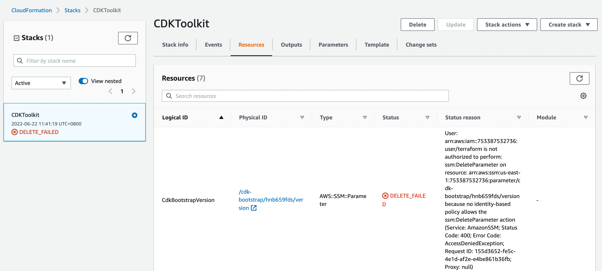
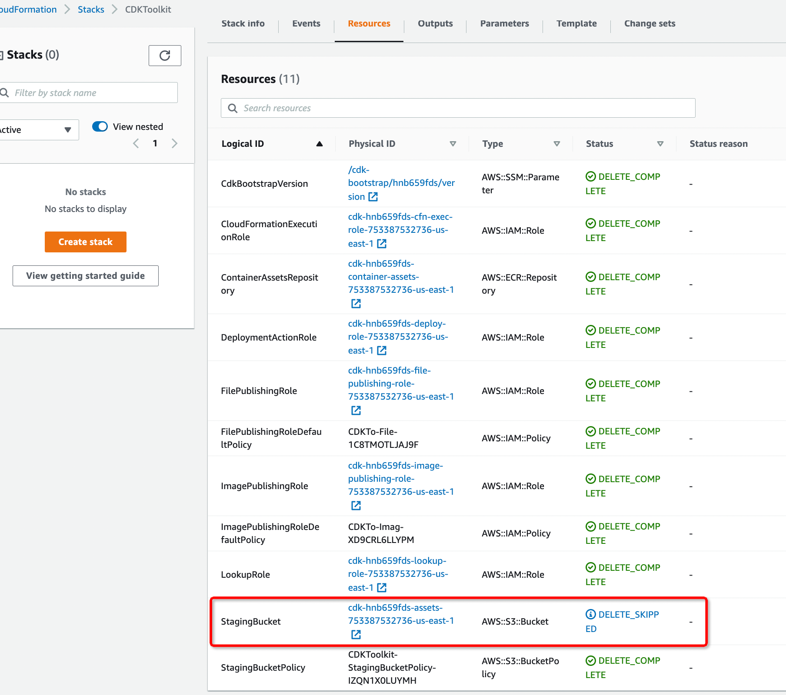

# CDK Basic


## Install CDK

```shell
➜  ~ npm install -g aws-cdk

added 2 packages, and audited 3 packages in 5s

found 0 vulnerabilities
```

Link: https://www.youtube.com/watch?v=v1U_6Dq6wog

## Start with a CDK project

### Init a CDK Golang project


```shell
➜  cdk-go-sample cdk init sample-app --language=go
Applying project template sample-app for go
# Welcome to your CDK Go project!

This is a blank project for Go development with CDK.

**NOTICE**: Go support is still in Developer Preview. This implies that APIs may
change while we address early feedback from the community. We would love to hear
about your experience through GitHub issues.

## Useful commands

 * `cdk deploy`      deploy this stack to your default AWS account/region
 * `cdk diff`        compare deployed stack with current state
 * `cdk synth`       emits the synthesized CloudFormation template
 * `go test`         run unit tests

Initializing a new git repository...
hint: Using 'master' as the name for the initial branch. This default branch name
hint: is subject to change. To configure the initial branch name to use in all
hint: of your new repositories, which will suppress this warning, call:
hint:
hint: 	git config --global init.defaultBranch <name>
hint:
hint: Names commonly chosen instead of 'master' are 'main', 'trunk' and
hint: 'development'. The just-created branch can be renamed via this command:
hint:
hint: 	git branch -m <name>
✅ All done!
```

```shell
➜  cdk-go-sample git:(master) ✗ go mod tidy

```

### cdk deploy

```shell
➜  cdk-go-sample git:(master) ✗ cdk deploy

✨  Synthesis time: 45.96s

current credentials could not be used to assume 'arn:aws:iam::753387532736:role/cdk-hnb659fds-lookup-role-753387532736-us-east-1', but are for the right account. Proceeding anyway.
(To get rid of this warning, please upgrade to bootstrap version >= 8)
current credentials could not be used to assume 'arn:aws:iam::753387532736:role/cdk-hnb659fds-deploy-role-753387532736-us-east-1', but are for the right account. Proceeding anyway.

User: arn:aws:iam::753387532736:user/terraform is not authorized to perform: cloudformation:DescribeStacks on resource: arn:aws:cloudformation:us-east-1:753387532736:stack/CdkGoSampleStack/* because no identity-based policy allows the cloudformation:DescribeStacks action
```

Authorize the permissions for CloudFormation and try again.

```shell
➜  cdk-go-sample git:(cdk) ✗ cdk deploy

✨  Synthesis time: 32.05s

current credentials could not be used to assume 'arn:aws:iam::753387532736:role/cdk-hnb659fds-lookup-role-753387532736-us-east-1', but are for the right account. Proceeding anyway.
(To get rid of this warning, please upgrade to bootstrap version >= 8)
current credentials could not be used to assume 'arn:aws:iam::753387532736:role/cdk-hnb659fds-deploy-role-753387532736-us-east-1', but are for the right account. Proceeding anyway.
This deployment will make potentially sensitive changes according to your current security approval level (--require-approval broadening).
Please confirm you intend to make the following modifications:

IAM Statement Changes
┌───┬─────────────────────────┬────────┬─────────────────┬───────────────────────────┬─────────────────────────────────────────────────────────┐
│   │ Resource                │ Effect │ Action          │ Principal                 │ Condition                                               │
├───┼─────────────────────────┼────────┼─────────────────┼───────────────────────────┼─────────────────────────────────────────────────────────┤
│ + │ ${CdkGoSampleQueue.Arn} │ Allow  │ sqs:SendMessage │ Service:sns.amazonaws.com │ "ArnEquals": {                                          │
│   │                         │        │                 │                           │   "aws:SourceArn": "${CdkGoSampleTopic}"                │
│   │                         │        │                 │                           │ }                                                       │
└───┴─────────────────────────┴────────┴─────────────────┴───────────────────────────┴─────────────────────────────────────────────────────────┘
(NOTE: There may be security-related changes not in this list. See https://github.com/aws/aws-cdk/issues/1299)

Do you wish to deploy these changes (y/n)? y
CdkGoSampleStack: deploying...
current credentials could not be used to assume 'arn:aws:iam::753387532736:role/cdk-hnb659fds-deploy-role-753387532736-us-east-1', but are for the right account. Proceeding anyway.
Could not read SSM parameter /cdk-bootstrap/hnb659fds/version: User: arn:aws:iam::753387532736:user/terraform is not authorized to perform: ssm:GetParameter on resource: arn:aws:ssm:us-east-1:753387532736:parameter/cdk-bootstrap/hnb659fds/version because no identity-based policy allows the ssm:GetParameter action

 ❌  CdkGoSampleStack failed: Error: CdkGoSampleStack: This CDK deployment requires bootstrap stack version '6', found an older version. Please run 'cdk bootstrap'.
    at CloudFormationDeployments.validateBootstrapStackVersion (/usr/local/lib/node_modules/aws-cdk/lib/api/cloudformation-deployments.ts:482:13)
    at processTicksAndRejections (node:internal/process/task_queues:95:5)
    at CloudFormationDeployments.publishStackAssets (/usr/local/lib/node_modules/aws-cdk/lib/api/cloudformation-deployments.ts:457:7)
    at CloudFormationDeployments.deployStack (/usr/local/lib/node_modules/aws-cdk/lib/api/cloudformation-deployments.ts:339:7)
    at CdkToolkit.deploy (/usr/local/lib/node_modules/aws-cdk/lib/cdk-toolkit.ts:209:24)
    at initCommandLine (/usr/local/lib/node_modules/aws-cdk/lib/cli.ts:341:12)

CdkGoSampleStack: This CDK deployment requires bootstrap stack version '6', found an older version. Please run 'cdk bootstrap'.
```

### cdk bootstrap

```shell
➜  cdk-go-sample git:(cdk) ✗ cdk bootstrap
 ⏳  Bootstrapping environment aws://753387532736/us-east-1...
Trusted accounts for deployment: (none)
Trusted accounts for lookup: (none)
Using default execution policy of 'arn:aws:iam::aws:policy/AdministratorAccess'. Pass '--cloudformation-execution-policies' to customize.
CDKToolkit: creating CloudFormation changeset...
11:13:16 AM | CREATE_FAILED        | AWS::IAM::Role        | ImagePublishingRole
API: iam:GetRole User: arn:aws:iam::753387532736:user/terraform is not authorized to perform: iam:GetRole on resource: role cdk-hnb659fds-image-publishing-role-753387532736-us-e
ast-1 because no identity-based policy allows the iam:GetRole action

11:13:16 AM | CREATE_FAILED        | AWS::IAM::Role        | FilePublishingRole
API: iam:GetRole User: arn:aws:iam::753387532736:user/terraform is not authorized to perform: iam:GetRole on resource: role cdk-hnb659fds-file-publishing-role-753387532736-us-ea
st-1 because no identity-based policy allows the iam:GetRole action

11:13:16 AM | CREATE_FAILED        | AWS::IAM::Role        | LookupRole
API: iam:GetRole User: arn:aws:iam::753387532736:user/terraform is not authorized to perform: iam:GetRole on resource: role cdk-hnb659fds-lookup-role-753387532736-us-east-1 beca
use no identity-based policy allows the iam:GetRole action

11:13:16 AM | CREATE_FAILED        | AWS::IAM::Role        | CloudFormationExecutionRole
API: iam:GetRole User: arn:aws:iam::753387532736:user/terraform is not authorized to perform: iam:GetRole on resource: role cdk-hnb659fds-cfn-exec-role-753387532736-us-east-1 be
cause no identity-based policy allows the iam:GetRole action

 ❌  Environment aws://753387532736/us-east-1 failed bootstrapping: Error: The stack named CDKToolkit failed creation, it may need to be manually deleted from the AWS console: ROLLBACK_COMPLETE: API: iam:GetRole User: arn:aws:iam::753387532736:user/terraform is not authorized to perform: iam:GetRole on resource: role cdk-hnb659fds-image-publishing-role-753387532736-us-east-1 because no identity-based policy allows the iam:GetRole action, API: iam:GetRole User: arn:aws:iam::753387532736:user/terraform is not authorized to perform: iam:GetRole on resource: role cdk-hnb659fds-file-publishing-role-753387532736-us-east-1 because no identity-based policy allows the iam:GetRole action, API: iam:GetRole User: arn:aws:iam::753387532736:user/terraform is not authorized to perform: iam:GetRole on resource: role cdk-hnb659fds-lookup-role-753387532736-us-east-1 because no identity-based policy allows the iam:GetRole action, API: iam:GetRole User: arn:aws:iam::753387532736:user/terraform is not authorized to perform: iam:GetRole on resource: role cdk-hnb659fds-cfn-exec-role-753387532736-us-east-1 because no identity-based policy allows the iam:GetRole action
    at prepareAndExecuteChangeSet (/usr/local/lib/node_modules/aws-cdk/lib/api/deploy-stack.ts:385:13)
    at processTicksAndRejections (node:internal/process/task_queues:95:5)
    at /usr/local/lib/node_modules/aws-cdk/lib/cdk-toolkit.ts:575:24
    at async Promise.all (index 0)
    at CdkToolkit.bootstrap (/usr/local/lib/node_modules/aws-cdk/lib/cdk-toolkit.ts:572:5)
    at initCommandLine (/usr/local/lib/node_modules/aws-cdk/lib/cli.ts:341:12)

The stack named CDKToolkit failed creation, it may need to be manually deleted from the AWS console: ROLLBACK_COMPLETE: API: iam:GetRole User: arn:aws:iam::753387532736:user/terraform is not authorized to perform: iam:GetRole on resource: role cdk-hnb659fds-image-publishing-role-753387532736-us-east-1 because no identity-based policy allows the iam:GetRole action, API: iam:GetRole User: arn:aws:iam::753387532736:user/terraform is not authorized to perform: iam:GetRole on resource: role cdk-hnb659fds-file-publishing-role-753387532736-us-east-1 because no identity-based policy allows the iam:GetRole action, API: iam:GetRole User: arn:aws:iam::753387532736:user/terraform is not authorized to perform: iam:GetRole on resource: role cdk-hnb659fds-lookup-role-753387532736-us-east-1 because no identity-based policy allows the iam:GetRole action, API: iam:GetRole User: arn:aws:iam::753387532736:user/terraform is not authorized to perform: iam:GetRole on resource: role cdk-hnb659fds-cfn-exec-role-753387532736-us-east-1 because no identity-based policy allows the iam:GetRole action
```

Grant permissions `IAMReadOnlyAccess` for the user.

```shell
➜  cdk-go-sample git:(cdk) ✗ cdk bootstrap
 ⏳  Bootstrapping environment aws://753387532736/us-east-1...
Trusted accounts for deployment: (none)
Trusted accounts for lookup: (none)
Using default execution policy of 'arn:aws:iam::aws:policy/AdministratorAccess'. Pass '--cloudformation-execution-policies' to customize.
CDKToolkit: creating CloudFormation changeset...
11:17:55 AM | CREATE_FAILED        | AWS::IAM::Role        | ImagePublishingRole
API: iam:CreateRole User: arn:aws:iam::753387532736:user/terraform is not authorized to perform: iam:CreateRole on resource: arn:aws:iam::753387532736:role/cdk-hnb659fds-image-p
ublishing-role-753387532736-us-east-1 because no identity-based policy allows the iam:CreateRole action

11:17:55 AM | CREATE_FAILED        | AWS::IAM::Role        | FilePublishingRole
API: iam:CreateRole User: arn:aws:iam::753387532736:user/terraform is not authorized to perform: iam:CreateRole on resource: arn:aws:iam::753387532736:role/cdk-hnb659fds-file-pu
blishing-role-753387532736-us-east-1 because no identity-based policy allows the iam:CreateRole action

11:17:55 AM | CREATE_FAILED        | AWS::IAM::Role        | CloudFormationExecutionRole
API: iam:CreateRole User: arn:aws:iam::753387532736:user/terraform is not authorized to perform: iam:CreateRole on resource: arn:aws:iam::753387532736:role/cdk-hnb659fds-cfn-exe
c-role-753387532736-us-east-1 because no identity-based policy allows the iam:CreateRole action

11:17:56 AM | CREATE_FAILED        | AWS::SSM::Parameter   | CdkBootstrapVersion
User: arn:aws:iam::753387532736:user/terraform is not authorized to perform: ssm:PutParameter on resource: arn:aws:ssm:us-east-1:753387532736:parameter/cdk-bootstrap/hnb659fds/v
ersion because no identity-based policy allows the ssm:PutParameter action (Service: AmazonSSM; Status Code: 400; Error Code: AccessDeniedException; Request ID: 654bdce7-8a90-4c
e6-ae9b-3f1122f551cd; Proxy: null)

11:17:56 AM | CREATE_FAILED        | AWS::IAM::Role        | LookupRole
API: iam:CreateRole User: arn:aws:iam::753387532736:user/terraform is not authorized to perform: iam:CreateRole on resource: arn:aws:iam::753387532736:role/cdk-hnb659fds-lookup-
role-753387532736-us-east-1 because no identity-based policy allows the iam:CreateRole action

 ❌  Environment aws://753387532736/us-east-1 failed bootstrapping: Error: The stack named CDKToolkit failed creation, it may need to be manually deleted from the AWS console: ROLLBACK_COMPLETE: API: iam:CreateRole User: arn:aws:iam::753387532736:user/terraform is not authorized to perform: iam:CreateRole on resource: arn:aws:iam::753387532736:role/cdk-hnb659fds-image-publishing-role-753387532736-us-east-1 because no identity-based policy allows the iam:CreateRole action, API: iam:CreateRole User: arn:aws:iam::753387532736:user/terraform is not authorized to perform: iam:CreateRole on resource: arn:aws:iam::753387532736:role/cdk-hnb659fds-file-publishing-role-753387532736-us-east-1 because no identity-based policy allows the iam:CreateRole action, API: iam:CreateRole User: arn:aws:iam::753387532736:user/terraform is not authorized to perform: iam:CreateRole on resource: arn:aws:iam::753387532736:role/cdk-hnb659fds-cfn-exec-role-753387532736-us-east-1 because no identity-based policy allows the iam:CreateRole action, User: arn:aws:iam::753387532736:user/terraform is not authorized to perform: ssm:PutParameter on resource: arn:aws:ssm:us-east-1:753387532736:parameter/cdk-bootstrap/hnb659fds/version because no identity-based policy allows the ssm:PutParameter action (Service: AmazonSSM; Status Code: 400; Error Code: AccessDeniedException; Request ID: 654bdce7-8a90-4ce6-ae9b-3f1122f551cd; Proxy: null), API: iam:CreateRole User: arn:aws:iam::753387532736:user/terraform is not authorized to perform: iam:CreateRole on resource: arn:aws:iam::753387532736:role/cdk-hnb659fds-lookup-role-753387532736-us-east-1 because no identity-based policy allows the iam:CreateRole action
    at prepareAndExecuteChangeSet (/usr/local/lib/node_modules/aws-cdk/lib/api/deploy-stack.ts:385:13)
    at processTicksAndRejections (node:internal/process/task_queues:95:5)
    at /usr/local/lib/node_modules/aws-cdk/lib/cdk-toolkit.ts:575:24
    at async Promise.all (index 0)
    at CdkToolkit.bootstrap (/usr/local/lib/node_modules/aws-cdk/lib/cdk-toolkit.ts:572:5)
    at initCommandLine (/usr/local/lib/node_modules/aws-cdk/lib/cli.ts:341:12)

The stack named CDKToolkit failed creation, it may need to be manually deleted from the AWS console: ROLLBACK_COMPLETE: API: iam:CreateRole User: arn:aws:iam::753387532736:user/terraform is not authorized to perform: iam:CreateRole on resource: arn:aws:iam::753387532736:role/cdk-hnb659fds-image-publishing-role-753387532736-us-east-1 because no identity-based policy allows the iam:CreateRole action, API: iam:CreateRole User: arn:aws:iam::753387532736:user/terraform is not authorized to perform: iam:CreateRole on resource: arn:aws:iam::753387532736:role/cdk-hnb659fds-file-publishing-role-753387532736-us-east-1 because no identity-based policy allows the iam:CreateRole action, API: iam:CreateRole User: arn:aws:iam::753387532736:user/terraform is not authorized to perform: iam:CreateRole on resource: arn:aws:iam::753387532736:role/cdk-hnb659fds-cfn-exec-role-753387532736-us-east-1 because no identity-based policy allows the iam:CreateRole action, User: arn:aws:iam::753387532736:user/terraform is not authorized to perform: ssm:PutParameter on resource: arn:aws:ssm:us-east-1:753387532736:parameter/cdk-bootstrap/hnb659fds/version because no identity-based policy allows the ssm:PutParameter action (Service: AmazonSSM; Status Code: 400; Error Code: AccessDeniedException; Request ID: 654bdce7-8a90-4ce6-ae9b-3f1122f551cd; Proxy: null), API: iam:CreateRole User: arn:aws:iam::753387532736:user/terraform is not authorized to perform: iam:CreateRole on resource: arn:aws:iam::753387532736:role/cdk-hnb659fds-lookup-role-753387532736-us-east-1 because no identity-based policy allows the iam:CreateRole action
```

Now permission `iam:CreateRole` is needed. Grant permission `IAMFullAccess` for it.

```shell
➜  cdk-go-sample git:(cdk) ✗ cdk bootstrap
 ⏳  Bootstrapping environment aws://753387532736/us-east-1...
Trusted accounts for deployment: (none)
Trusted accounts for lookup: (none)
Using default execution policy of 'arn:aws:iam::aws:policy/AdministratorAccess'. Pass '--cloudformation-execution-policies' to customize.
CDKToolkit: creating CloudFormation changeset...
11:22:26 AM | CREATE_FAILED        | AWS::S3::Bucket       | StagingBucket
cdk-hnb659fds-assets-753387532736-us-east-1 already exists

 ❌  Environment aws://753387532736/us-east-1 failed bootstrapping: Error: The stack named CDKToolkit failed creation, it may need to be manually deleted from the AWS console: ROLLBACK_COMPLETE: cdk-hnb659fds-assets-753387532736-us-east-1 already exists
    at prepareAndExecuteChangeSet (/usr/local/lib/node_modules/aws-cdk/lib/api/deploy-stack.ts:385:13)
    at processTicksAndRejections (node:internal/process/task_queues:95:5)
    at /usr/local/lib/node_modules/aws-cdk/lib/cdk-toolkit.ts:575:24
    at async Promise.all (index 0)
    at CdkToolkit.bootstrap (/usr/local/lib/node_modules/aws-cdk/lib/cdk-toolkit.ts:572:5)
    at initCommandLine (/usr/local/lib/node_modules/aws-cdk/lib/cli.ts:341:12)

The stack named CDKToolkit failed creation, it may need to be manually deleted from the AWS console: ROLLBACK_COMPLETE: cdk-hnb659fds-assets-753387532736-us-east-1 already exists
```

Manually delete the S3 bucket.

```shell
➜  cdk-go-sample git:(cdk) ✗ cdk bootstrap
 ⏳  Bootstrapping environment aws://753387532736/us-east-1...
Trusted accounts for deployment: (none)
Trusted accounts for lookup: (none)
Using default execution policy of 'arn:aws:iam::aws:policy/AdministratorAccess'. Pass '--cloudformation-execution-policies' to customize.
CDKToolkit: creating CloudFormation changeset...
11:25:58 AM | CREATE_FAILED        | AWS::ECR::Repository  | ContainerAssetsRepository
Resource handler returned message: "User: arn:aws:iam::753387532736:user/terraform is not authorized to perform: ecr:CreateRepository on resource: arn:aws:ecr:us-east-1:75338753
2736:repository/cdk-hnb659fds-container-assets-753387532736-us-east-1 because no identity-based policy allows the ecr:CreateRepository action (Service: Ecr, Status Code: 400, Re
quest ID: cb1142bd-3d61-4afa-b42b-f0a3ac97e524, Extended Request ID: null)" (RequestToken: d83c892a-97f3-b3d4-bb73-bb0162773fcc, HandlerErrorCode: GeneralServiceException)

11:25:59 AM | CREATE_FAILED        | AWS::SSM::Parameter   | CdkBootstrapVersion
User: arn:aws:iam::753387532736:user/terraform is not authorized to perform: ssm:PutParameter on resource: arn:aws:ssm:us-east-1:753387532736:parameter/cdk-bootstrap/hnb659fds/v
ersion because no identity-based policy allows the ssm:PutParameter action (Service: AmazonSSM; Status Code: 400; Error Code: AccessDeniedException; Request ID: a8adc318-e100-45
6e-8163-d207ce93c981; Proxy: null)

 ❌  Environment aws://753387532736/us-east-1 failed bootstrapping: Error: The stack named CDKToolkit failed creation, it may need to be manually deleted from the AWS console: ROLLBACK_COMPLETE: Resource handler returned message: "User: arn:aws:iam::753387532736:user/terraform is not authorized to perform: ecr:CreateRepository on resource: arn:aws:ecr:us-east-1:753387532736:repository/cdk-hnb659fds-container-assets-753387532736-us-east-1 because no identity-based policy allows the ecr:CreateRepository action (Service: Ecr, Status Code: 400, Request ID: cb1142bd-3d61-4afa-b42b-f0a3ac97e524, Extended Request ID: null)" (RequestToken: d83c892a-97f3-b3d4-bb73-bb0162773fcc, HandlerErrorCode: GeneralServiceException), User: arn:aws:iam::753387532736:user/terraform is not authorized to perform: ssm:PutParameter on resource: arn:aws:ssm:us-east-1:753387532736:parameter/cdk-bootstrap/hnb659fds/version because no identity-based policy allows the ssm:PutParameter action (Service: AmazonSSM; Status Code: 400; Error Code: AccessDeniedException; Request ID: a8adc318-e100-456e-8163-d207ce93c981; Proxy: null)
    at prepareAndExecuteChangeSet (/usr/local/lib/node_modules/aws-cdk/lib/api/deploy-stack.ts:385:13)
    at processTicksAndRejections (node:internal/process/task_queues:95:5)
    at /usr/local/lib/node_modules/aws-cdk/lib/cdk-toolkit.ts:575:24
    at async Promise.all (index 0)
    at CdkToolkit.bootstrap (/usr/local/lib/node_modules/aws-cdk/lib/cdk-toolkit.ts:572:5)
    at initCommandLine (/usr/local/lib/node_modules/aws-cdk/lib/cli.ts:341:12)

The stack named CDKToolkit failed creation, it may need to be manually deleted from the AWS console: ROLLBACK_COMPLETE: Resource handler returned message: "User: arn:aws:iam::753387532736:user/terraform is not authorized to perform: ecr:CreateRepository on resource: arn:aws:ecr:us-east-1:753387532736:repository/cdk-hnb659fds-container-assets-753387532736-us-east-1 because no identity-based policy allows the ecr:CreateRepository action (Service: Ecr, Status Code: 400, Request ID: cb1142bd-3d61-4afa-b42b-f0a3ac97e524, Extended Request ID: null)" (RequestToken: d83c892a-97f3-b3d4-bb73-bb0162773fcc, HandlerErrorCode: GeneralServiceException), User: arn:aws:iam::753387532736:user/terraform is not authorized to perform: ssm:PutParameter on resource: arn:aws:ssm:us-east-1:753387532736:parameter/cdk-bootstrap/hnb659fds/version because no identity-based policy allows the ssm:PutParameter action (Service: AmazonSSM; Status Code: 400; Error Code: AccessDeniedException; Request ID: a8adc318-e100-456e-8163-d207ce93c981; Proxy: null)
```

Granted permission `AmazonElasticContainerRegistryPublicFullAccess`.

```shell
➜  cdk-go-sample git:(cdk) ✗ cdk bootstrap
 ⏳  Bootstrapping environment aws://753387532736/us-east-1...
Trusted accounts for deployment: (none)
Trusted accounts for lookup: (none)
Using default execution policy of 'arn:aws:iam::aws:policy/AdministratorAccess'. Pass '--cloudformation-execution-policies' to customize.
CDKToolkit: creating CloudFormation changeset...
11:29:27 AM | CREATE_FAILED        | AWS::S3::Bucket       | StagingBucket
cdk-hnb659fds-assets-753387532736-us-east-1 already exists

11:29:29 AM | CREATE_FAILED        | AWS::SSM::Parameter   | CdkBootstrapVersion
User: arn:aws:iam::753387532736:user/terraform is not authorized to perform: ssm:PutParameter on resource: arn:aws:ssm:us-east-1:753387532736:parameter/cdk-bootstrap/hnb659fds/v
ersion because no identity-based policy allows the ssm:PutParameter action (Service: AmazonSSM; Status Code: 400; Error Code: AccessDeniedException; Request ID: 88bc4a30-3317-47
87-b049-c13a95dd8d04; Proxy: null)

 ❌  Environment aws://753387532736/us-east-1 failed bootstrapping: Error: The stack named CDKToolkit failed creation, it may need to be manually deleted from the AWS console: ROLLBACK_COMPLETE: cdk-hnb659fds-assets-753387532736-us-east-1 already exists, User: arn:aws:iam::753387532736:user/terraform is not authorized to perform: ssm:PutParameter on resource: arn:aws:ssm:us-east-1:753387532736:parameter/cdk-bootstrap/hnb659fds/version because no identity-based policy allows the ssm:PutParameter action (Service: AmazonSSM; Status Code: 400; Error Code: AccessDeniedException; Request ID: 88bc4a30-3317-4787-b049-c13a95dd8d04; Proxy: null)
    at prepareAndExecuteChangeSet (/usr/local/lib/node_modules/aws-cdk/lib/api/deploy-stack.ts:385:13)
    at processTicksAndRejections (node:internal/process/task_queues:95:5)
    at /usr/local/lib/node_modules/aws-cdk/lib/cdk-toolkit.ts:575:24
    at async Promise.all (index 0)
    at CdkToolkit.bootstrap (/usr/local/lib/node_modules/aws-cdk/lib/cdk-toolkit.ts:572:5)
    at initCommandLine (/usr/local/lib/node_modules/aws-cdk/lib/cli.ts:341:12)

The stack named CDKToolkit failed creation, it may need to be manually deleted from the AWS console: ROLLBACK_COMPLETE: cdk-hnb659fds-assets-753387532736-us-east-1 already exists, User: arn:aws:iam::753387532736:user/terraform is not authorized to perform: ssm:PutParameter on resource: arn:aws:ssm:us-east-1:753387532736:parameter/cdk-bootstrap/hnb659fds/version because no identity-based policy allows the ssm:PutParameter action (Service: AmazonSSM; Status Code: 400; Error Code: AccessDeniedException; Request ID: 88bc4a30-3317-4787-b049-c13a95dd8d04; Proxy: null)
```


Granted the exact policy.

```shell
➜  cdk-go-sample git:(cdk) ✗ cdk bootstrap
 ⏳  Bootstrapping environment aws://753387532736/us-east-1...
Trusted accounts for deployment: (none)
Trusted accounts for lookup: (none)
Using default execution policy of 'arn:aws:iam::aws:policy/AdministratorAccess'. Pass '--cloudformation-execution-policies' to customize.
CDKToolkit: creating CloudFormation changeset...
11:41:36 AM | CREATE_FAILED        | AWS::ECR::Repository  | ContainerAssetsRepository
Resource handler returned message: "User: arn:aws:iam::753387532736:user/terraform is not authorized to perform: ecr:CreateRepository on resource: arn:aws:ecr:us-east-1:75338753
2736:repository/cdk-hnb659fds-container-assets-753387532736-us-east-1 because no identity-based policy allows the ecr:CreateRepository action (Service: Ecr, Status Code: 400, Re
quest ID: 7323a37f-98fc-4113-8d41-4384318f14f6, Extended Request ID: null)" (RequestToken: 6cae7430-2f08-9a38-4aaf-adb4a74059b4, HandlerErrorCode: GeneralServiceException)

11:42:02 AM | DELETE_FAILED        | AWS::SSM::Parameter   | CdkBootstrapVersion
User: arn:aws:iam::753387532736:user/terraform is not authorized to perform: ssm:DeleteParameter on resource: arn:aws:ssm:us-east-1:753387532736:parameter/cdk-bootstrap/hnb659fd
s/version because no identity-based policy allows the ssm:DeleteParameter action (Service: AmazonSSM; Status Code: 400; Error Code: AccessDeniedException; Request ID: 4d5faa90-1
393-45e7-b10d-0f7bcae45b1d; Proxy: null)

 ❌  Environment aws://753387532736/us-east-1 failed bootstrapping: Error: The stack named CDKToolkit failed creation, it may need to be manually deleted from the AWS console: ROLLBACK_FAILED (The following resource(s) failed to delete: [CdkBootstrapVersion]. ): Resource handler returned message: "User: arn:aws:iam::753387532736:user/terraform is not authorized to perform: ecr:CreateRepository on resource: arn:aws:ecr:us-east-1:753387532736:repository/cdk-hnb659fds-container-assets-753387532736-us-east-1 because no identity-based policy allows the ecr:CreateRepository action (Service: Ecr, Status Code: 400, Request ID: 7323a37f-98fc-4113-8d41-4384318f14f6, Extended Request ID: null)" (RequestToken: 6cae7430-2f08-9a38-4aaf-adb4a74059b4, HandlerErrorCode: GeneralServiceException)
    at prepareAndExecuteChangeSet (/usr/local/lib/node_modules/aws-cdk/lib/api/deploy-stack.ts:385:13)
    at processTicksAndRejections (node:internal/process/task_queues:95:5)
    at /usr/local/lib/node_modules/aws-cdk/lib/cdk-toolkit.ts:575:24
    at async Promise.all (index 0)
    at CdkToolkit.bootstrap (/usr/local/lib/node_modules/aws-cdk/lib/cdk-toolkit.ts:572:5)
    at initCommandLine (/usr/local/lib/node_modules/aws-cdk/lib/cli.ts:341:12)

The stack named CDKToolkit failed creation, it may need to be manually deleted from the AWS console: ROLLBACK_FAILED (The following resource(s) failed to delete: [CdkBootstrapVersion]. ): Resource handler returned message: "User: arn:aws:iam::753387532736:user/terraform is not authorized to perform: ecr:CreateRepository on resource: arn:aws:ecr:us-east-1:753387532736:repository/cdk-hnb659fds-container-assets-753387532736-us-east-1 because no identity-based policy allows the ecr:CreateRepository action (Service: Ecr, Status Code: 400, Request ID: 7323a37f-98fc-4113-8d41-4384318f14f6, Extended Request ID: null)" (RequestToken: 6cae7430-2f08-9a38-4aaf-adb4a74059b4, HandlerErrorCode: GeneralServiceException)
```

Granted the exact policy for ecr.

```shell
➜  cdk-go-sample git:(cdk) ✗ cdk bootstrap
 ⏳  Bootstrapping environment aws://753387532736/us-east-1...
Trusted accounts for deployment: (none)
Trusted accounts for lookup: (none)
Using default execution policy of 'arn:aws:iam::aws:policy/AdministratorAccess'. Pass '--cloudformation-execution-policies' to customize.
 ❌  Environment aws://753387532736/us-east-1 failed bootstrapping: Error: The stack named CDKToolkit is in a failed state. You may need to delete it from the AWS console : DELETE_FAILED (The following resource(s) failed to delete: [CdkBootstrapVersion]. )
    at waitForStackDelete (/usr/local/lib/node_modules/aws-cdk/lib/api/util/cloudformation.ts:315:11)
    at processTicksAndRejections (node:internal/process/task_queues:95:5)
    at deployStack (/usr/local/lib/node_modules/aws-cdk/lib/api/deploy-stack.ts:223:26)
    at /usr/local/lib/node_modules/aws-cdk/lib/cdk-toolkit.ts:575:24
    at async Promise.all (index 0)
    at CdkToolkit.bootstrap (/usr/local/lib/node_modules/aws-cdk/lib/cdk-toolkit.ts:572:5)
    at initCommandLine (/usr/local/lib/node_modules/aws-cdk/lib/cli.ts:341:12)

The stack named CDKToolkit is in a failed state. You may need to delete it from the AWS console : DELETE_FAILED (The following resource(s) failed to delete: [CdkBootstrapVersion]. )
```

```shell
➜  cdk-go-sample git:(cdk) ✗ cdk bootstrap
 ⏳  Bootstrapping environment aws://753387532736/us-east-1...
Trusted accounts for deployment: (none)
Trusted accounts for lookup: (none)
Using default execution policy of 'arn:aws:iam::aws:policy/AdministratorAccess'. Pass '--cloudformation-execution-policies' to customize.
CDKToolkit: creating CloudFormation changeset...
 ❌  Environment aws://753387532736/us-east-1 failed bootstrapping: Error [ValidationError]: Stack:arn:aws:cloudformation:us-east-1:753387532736:stack/CDKToolkit/2da112c0-f1dd-11ec-a0b1-0af7b5cc55e9 is in DELETE_FAILED state and can not be updated.
    at Request.extractError (/usr/local/lib/node_modules/aws-sdk/lib/protocol/query.js:50:29)
    at Request.callListeners (/usr/local/lib/node_modules/aws-sdk/lib/sequential_executor.js:106:20)
    at Request.emit (/usr/local/lib/node_modules/aws-sdk/lib/sequential_executor.js:78:10)
    at Request.emit (/usr/local/lib/node_modules/aws-sdk/lib/request.js:686:14)
    at Request.transition (/usr/local/lib/node_modules/aws-sdk/lib/request.js:22:10)
    at AcceptorStateMachine.runTo (/usr/local/lib/node_modules/aws-sdk/lib/state_machine.js:14:12)
    at /usr/local/lib/node_modules/aws-sdk/lib/state_machine.js:26:10
    at Request.<anonymous> (/usr/local/lib/node_modules/aws-sdk/lib/request.js:38:9)
    at Request.<anonymous> (/usr/local/lib/node_modules/aws-sdk/lib/request.js:688:12)
    at Request.callListeners (/usr/local/lib/node_modules/aws-sdk/lib/sequential_executor.js:116:18) {
  code: 'ValidationError',
  time: 2022-06-22T03:44:21.410Z,
  requestId: '7b3d2f61-9731-42ab-a95c-ee1f6e8a5cc6',
  statusCode: 400,
  retryable: false,
  retryDelay: 140.18825313796702
}

Stack:arn:aws:cloudformation:us-east-1:753387532736:stack/CDKToolkit/2da112c0-f1dd-11ec-a0b1-0af7b5cc55e9 is in DELETE_FAILED state and can not be updated.
```



Grant permission `ssm:DeleteParameter`.

Manually deleted the stackset of CloudFormation and try again.

```shell
➜  cdk-go-sample git:(cdk) ✗ cdk bootstrap
 ⏳  Bootstrapping environment aws://753387532736/us-east-1...
Trusted accounts for deployment: (none)
Trusted accounts for lookup: (none)
Using default execution policy of 'arn:aws:iam::aws:policy/AdministratorAccess'. Pass '--cloudformation-execution-policies' to customize.
CDKToolkit: creating CloudFormation changeset...
11:49:58 AM | CREATE_FAILED        | AWS::S3::Bucket       | StagingBucket
cdk-hnb659fds-assets-753387532736-us-east-1 already exists

11:50:33 AM | DELETE_FAILED        | AWS::ECR::Repository  | ContainerAssetsRepository
Resource handler returned message: "User: arn:aws:iam::753387532736:user/terraform is not authorized to perform: ecr:DeleteRepository on resource: arn:aws:ecr:us-east-1:75338753
2736:repository/cdk-hnb659fds-container-assets-753387532736-us-east-1 because no identity-based policy allows the ecr:DeleteRepository action (Service: Ecr, Status Code: 400, Re
quest ID: 1f51dec7-e73d-425b-b50b-2e79312ada0b, Extended Request ID: null)" (RequestToken: 2af133ca-e29d-8863-5863-ff1bb29bfe91, HandlerErrorCode: GeneralServiceException)

 ❌  Environment aws://753387532736/us-east-1 failed bootstrapping: Error: The stack named CDKToolkit failed creation, it may need to be manually deleted from the AWS console: ROLLBACK_FAILED (The following resource(s) failed to delete: [ContainerAssetsRepository]. ): cdk-hnb659fds-assets-753387532736-us-east-1 already exists, Resource handler returned message: "User: arn:aws:iam::753387532736:user/terraform is not authorized to perform: ecr:DeleteRepository on resource: arn:aws:ecr:us-east-1:753387532736:repository/cdk-hnb659fds-container-assets-753387532736-us-east-1 because no identity-based policy allows the ecr:DeleteRepository action (Service: Ecr, Status Code: 400, Request ID: 1f51dec7-e73d-425b-b50b-2e79312ada0b, Extended Request ID: null)" (RequestToken: 2af133ca-e29d-8863-5863-ff1bb29bfe91, HandlerErrorCode: GeneralServiceException)
    at prepareAndExecuteChangeSet (/usr/local/lib/node_modules/aws-cdk/lib/api/deploy-stack.ts:385:13)
    at processTicksAndRejections (node:internal/process/task_queues:95:5)
    at /usr/local/lib/node_modules/aws-cdk/lib/cdk-toolkit.ts:575:24
    at async Promise.all (index 0)
    at CdkToolkit.bootstrap (/usr/local/lib/node_modules/aws-cdk/lib/cdk-toolkit.ts:572:5)
    at initCommandLine (/usr/local/lib/node_modules/aws-cdk/lib/cli.ts:341:12)

The stack named CDKToolkit failed creation, it may need to be manually deleted from the AWS console: ROLLBACK_FAILED (The following resource(s) failed to delete: [ContainerAssetsRepository]. ): cdk-hnb659fds-assets-753387532736-us-east-1 already exists, Resource handler returned message: "User: arn:aws:iam::753387532736:user/terraform is not authorized to perform: ecr:DeleteRepository on resource: arn:aws:ecr:us-east-1:753387532736:repository/cdk-hnb659fds-container-assets-753387532736-us-east-1 because no identity-based policy allows the ecr:DeleteRepository action (Service: Ecr, Status Code: 400, Request ID: 1f51dec7-e73d-425b-b50b-2e79312ada0b, Extended Request ID: null)" (RequestToken: 2af133ca-e29d-8863-5863-ff1bb29bfe91, HandlerErrorCode: GeneralServiceException)
```

Grant the permissions.

```shell
➜  cdk-go-sample git:(cdk) ✗ cdk bootstrap
 ⏳  Bootstrapping environment aws://753387532736/us-east-1...
Trusted accounts for deployment: (none)
Trusted accounts for lookup: (none)
Using default execution policy of 'arn:aws:iam::aws:policy/AdministratorAccess'. Pass '--cloudformation-execution-policies' to customize.
CDKToolkit: creating CloudFormation changeset...
 ✅  Environment aws://753387532736/us-east-1 bootstrapped.
```

### Now back to `cdk deploy`

Run again.

```shell
➜  cdk-go-sample git:(cdk) ✗ cdk deploy

✨  Synthesis time: 9.76s

current credentials could not be used to assume 'arn:aws:iam::753387532736:role/cdk-hnb659fds-lookup-role-753387532736-us-east-1', but are for the right account. Proceeding anyway.
(To get rid of this warning, please upgrade to bootstrap version >= 8)
current credentials could not be used to assume 'arn:aws:iam::753387532736:role/cdk-hnb659fds-deploy-role-753387532736-us-east-1', but are for the right account. Proceeding anyway.
This deployment will make potentially sensitive changes according to your current security approval level (--require-approval broadening).
Please confirm you intend to make the following modifications:

IAM Statement Changes
┌───┬─────────────────────────┬────────┬─────────────────┬───────────────────────────┬─────────────────────────────────────────────────────────┐
│   │ Resource                │ Effect │ Action          │ Principal                 │ Condition                                               │
├───┼─────────────────────────┼────────┼─────────────────┼───────────────────────────┼─────────────────────────────────────────────────────────┤
│ + │ ${CdkGoSampleQueue.Arn} │ Allow  │ sqs:SendMessage │ Service:sns.amazonaws.com │ "ArnEquals": {                                          │
│   │                         │        │                 │                           │   "aws:SourceArn": "${CdkGoSampleTopic}"                │
│   │                         │        │                 │                           │ }                                                       │
└───┴─────────────────────────┴────────┴─────────────────┴───────────────────────────┴─────────────────────────────────────────────────────────┘
(NOTE: There may be security-related changes not in this list. See https://github.com/aws/aws-cdk/issues/1299)

Do you wish to deploy these changes (y/n)? y
CdkGoSampleStack: deploying...
current credentials could not be used to assume 'arn:aws:iam::753387532736:role/cdk-hnb659fds-deploy-role-753387532736-us-east-1', but are for the right account. Proceeding anyway.
[0%] start: Publishing 02239caec3c9e6e43558e3f4f5edc0e4201ad0c4732f2da77ed7f1f680c9c7bd:current_account-current_region
current credentials could not be used to assume 'arn:aws:iam::753387532736:role/cdk-hnb659fds-file-publishing-role-753387532736-us-east-1', but are for the right account. Proceeding anyway.
[100%] success: Published 02239caec3c9e6e43558e3f4f5edc0e4201ad0c4732f2da77ed7f1f680c9c7bd:current_account-current_region
CdkGoSampleStack: creating CloudFormation changeset...

 ✅  CdkGoSampleStack

✨  Deployment time: 107.12s

Stack ARN:
arn:aws:cloudformation:us-east-1:753387532736:stack/CdkGoSampleStack/01ee3ba0-f1fe-11ec-8438-0a36b0aa9e07

✨  Total time: 116.88s
```

Looking into cdk-go-sample.go, you can see it will create an SNS topic.

```go
func NewCdkGoSampleStack(scope constructs.Construct, id string, props *CdkGoSampleStackProps) awscdk.Stack {
	var sprops awscdk.StackProps
	if props != nil {
		sprops = props.StackProps
	}
	stack := awscdk.NewStack(scope, &id, &sprops)

	queue := awssqs.NewQueue(stack, jsii.String("CdkGoSampleQueue"), &awssqs.QueueProps{
		VisibilityTimeout: awscdk.Duration_Seconds(jsii.Number(300)),
	})

	topic := awssns.NewTopic(stack, jsii.String("CdkGoSampleTopic"), &awssns.TopicProps{})
	topic.AddSubscription(awssnssubscriptions.NewSqsSubscription(queue, &awssnssubscriptions.SqsSubscriptionProps{}))

	return stack
}
```

### Create an S3 bucket

Added one line to creat an S3 bucket.

```go
awss3.NewBucket(stack, jsii.String("cdk-zzx-0722"), &awss3.BucketProps{})

```

Run `cdk deploy` again and I get:

```shell
➜  cdk-go-sample git:(cdk) ✗ aws s3 ls
2022-06-22 15:33:38 cdk-hnb659fds-assets-753387532736-us-east-1
2022-06-22 15:46:39 cdkgosamplestack-cdkzzx0722602618cd-d3d3ybbl9aqi
```

### Removed lines of create SNS topics.

```go
func NewCdkGoSampleStack(scope constructs.Construct, id string, props *CdkGoSampleStackProps) awscdk.Stack {
	var sprops awscdk.StackProps
	if props != nil {
		sprops = props.StackProps
	}
	stack := awscdk.NewStack(scope, &id, &sprops)

	//queue := awssqs.NewQueue(stack, jsii.String("CdkGoSampleQueue"), &awssqs.QueueProps{
	//	VisibilityTimeout: awscdk.Duration_Seconds(jsii.Number(300)),
	//})

	//topic := awssns.NewTopic(stack, jsii.String("CdkGoSampleTopic"), &awssns.TopicProps{})
	//topic.AddSubscription(awssnssubscriptions.NewSqsSubscription(queue, &awssnssubscriptions.SqsSubscriptionProps{}))

	awss3.NewBucket(stack, jsii.String("cdk-zzx-0722"), &awss3.BucketProps{})

	return stack
}

```

Run `cdk deploy` again.

```shell
➜  cdk-go-sample git:(cdk) ✗ cdk deploy

✨  Synthesis time: 9.57s

current credentials could not be used to assume 'arn:aws:iam::753387532736:role/cdk-hnb659fds-lookup-role-753387532736-us-east-1', but are for the right account. Proceeding anyway.
(To get rid of this warning, please upgrade to bootstrap version >= 8)
current credentials could not be used to assume 'arn:aws:iam::753387532736:role/cdk-hnb659fds-deploy-role-753387532736-us-east-1', but are for the right account. Proceeding anyway.
CdkGoSampleStack: deploying...
current credentials could not be used to assume 'arn:aws:iam::753387532736:role/cdk-hnb659fds-deploy-role-753387532736-us-east-1', but are for the right account. Proceeding anyway.
[0%] start: Publishing 4fea6e9d5377c65f64c3a9127720b16d69b01e0533ae633d570d6131ec5cb667:current_account-current_region
current credentials could not be used to assume 'arn:aws:iam::753387532736:role/cdk-hnb659fds-file-publishing-role-753387532736-us-east-1', but are for the right account. Proceeding anyway.
[100%] success: Published 4fea6e9d5377c65f64c3a9127720b16d69b01e0533ae633d570d6131ec5cb667:current_account-current_region
CdkGoSampleStack: creating CloudFormation changeset...

 ✅  CdkGoSampleStack

✨  Deployment time: 101.63s

Stack ARN:
arn:aws:cloudformation:us-east-1:753387532736:stack/CdkGoSampleStack/01ee3ba0-f1fe-11ec-8438-0a36b0aa9e07

✨  Total time: 111.2s
```

The SNS topics is removed.

### Destroy

The CDK project will create these resources.
- Cloudformation stack
- S3 bucket
- ECR repository

Running `cdk destroy` will remove most of these resources :(



## How to smoothly run a CDK sample

Grant these permissions need for CDK in advance for the user.
- ecr:CreateRepository
- ecr:DeleteRepository
- ssm:PutParameter
- iam:CreateRole
- iam:GetRole

## What I have learnt from CDK

- CDK provides a code-level way to manage cloud resources

- CDK SDK is completely different from AWS cloud SDK

The SDK is not the same to AWS sdk github.com/aws/aws-cdk-go/awscdk/v2/awss3.

- CDK deploying and destroying could not call in Go

CDK CLI is developed from NodeJS, so there won't be any Golang API to call.

## Reference

- AWS CDK Go Sample project: https://github.com/zzxwill/cdk-go-sample.git
