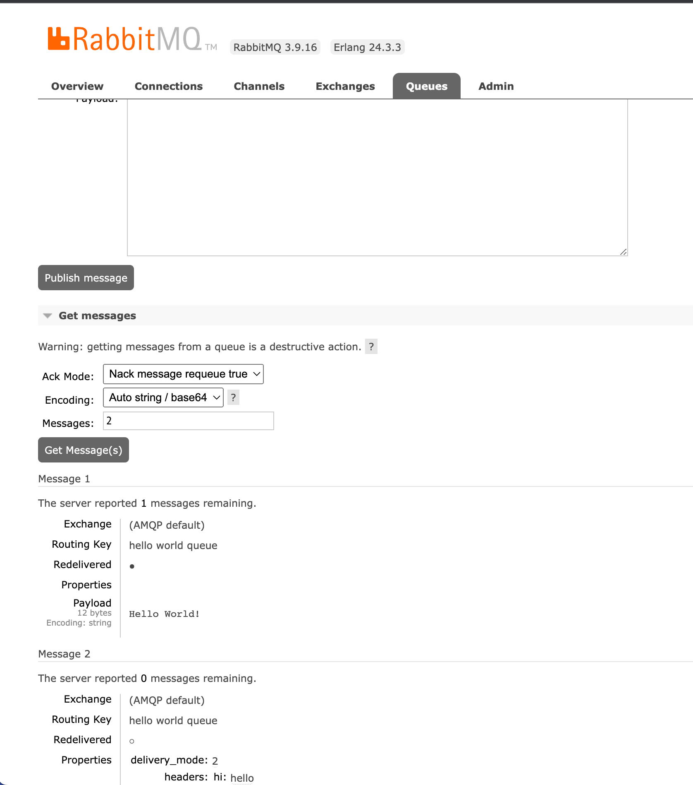

# Message Queue

Posted on Sep. 11, 2022

---

It's my first time to learn Message Queue.

# Not going well in Volcano Engine

I tried to do a PoC in [Volcano Engine](https://www.volcengine.com/). I provisioned a RabbitMQ cluster with public connection,
but I failed to run it smoothly with the [instruction](https://www.volcengine.com/docs/6451/71229).

# Try in AWS

## Introduce MQ broker

AWS regards MQ as a message broker.

>Amazon MQ is a managed message broker service for Apache ActiveMQ and RabbitMQ that makes it easy to set up and operate message brokers in the cloud, so you can migrate your messaging and applications without rewriting code.

## Create a MQ cluster

Create an AWS RabbitMQ cluster with username/password access. If forgotten, there would be [a serious problem](https://twitter.com/zzxwill/status/1568874092555829248?s=20&t=HUf3TWkk0N1Cb5dUNUquOA).

## Declare a queue, publish and consume messages

Followed the instruction [Using Python Pika with Amazon MQ for RabbitMQ](https://docs.aws.amazon.com/amazon-mq/latest/developer-guide/amazon-mq-rabbitmq-pika.html)
to declare a queue, publish messages to the queue and consume them from it.

I can also review the queue and message via the RabbitMQ web console.

# Docs

- [Setup RabbitMQ on your MacOS in 3 mins](https://medium.com/macoclock/setup-rabbitmq-on-your-macos-in-3-mins-f27d3ce25f55)

