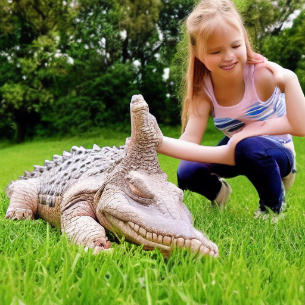
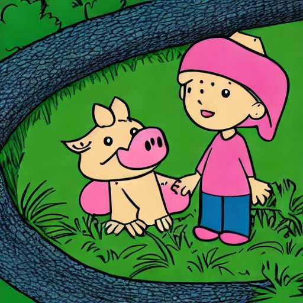
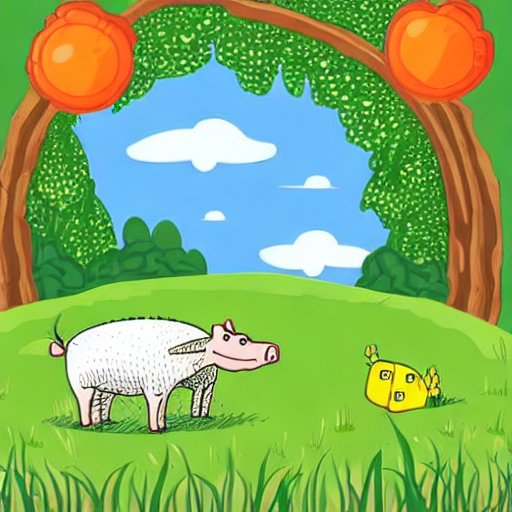
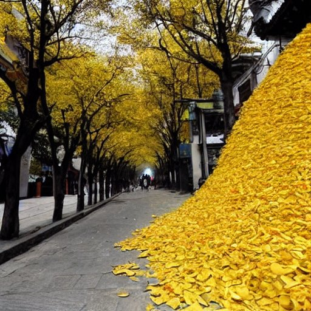
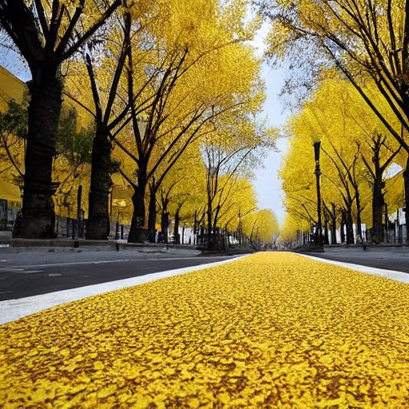
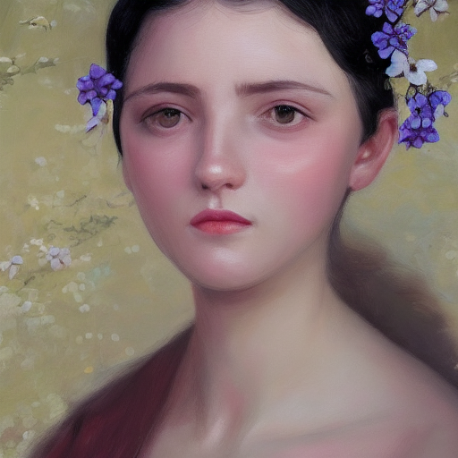
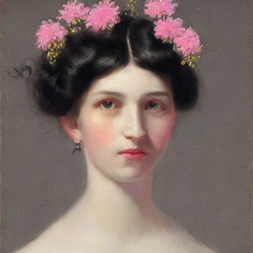
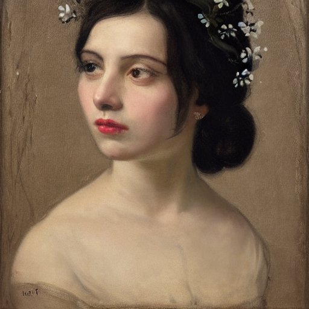
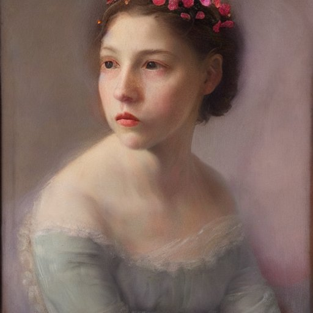

# Try Stable Diffusion

Posted on Nov. 6, 2022

---

## References

Stable Diffusion is built by the company [Stability AI](https://stability.ai/), it's an open source text-to-image model
that can generate images from text descriptions. Its codebase is [https://github.com/CompVis/stable-diffusion](https://github.com/CompVis/stable-diffusion).

Stability AI also has a commercial product called [DreamStudio](https://beta.dreamstudio.ai).

> DreamStudio is an easy-to-use interface for creating images using the recently released Stable Diffusion image generation model. Stable Diffusion is a fast, efficient model for creating images from text which understands the relationships between words and images. It can create high quality images of anything you can imagine in seconds–just type in a text prompt and hit Dream.

> Feel free to experiment with your complementary credits. Be sure to keep an eye on your credit meter. Credits correlate directly to compute; increasing the number of steps or image resolution increases compute usage and will cost significantly more credits. If you run out of credits, more may be purchased in the “Membership” section of your account.

> Your account also includes an API key which will allow you to generate images in external applications.

## Where to start

Stability AI has a partner called Hugging Face who hosted the model weights and provides an online site for us to generate
images. The site is [https://huggingface.co/spaces/stabilityai/stable-diffusion](https://huggingface.co/spaces/stabilityai/stable-diffusion).

Or we can generate from the code [https://github.com/CompVis/stable-diffusion](https://github.com/CompVis/stable-diffusion).

We can also try the commercial product [DreamStudio](https://beta.dreamstudio.ai), as everyone can get some credits for free.

On macOS, you can easily install an app called [DiffusionBee](https://diffusionbee.com/) to have a try.

## Some samples

I used the following inputs to generate some images.

- Girl with a Pearl Earring
- a hyperreal portrait of a young lady, black hair with tiny flowers on the head, light colour cloths, a clean neck
- a lovely cartoon crocodile on a grassland with a child by the side
- a street is full of deep yellow gingko leaves with gingko on both side of the road in Peking
- Girl with a Pearl Earring

