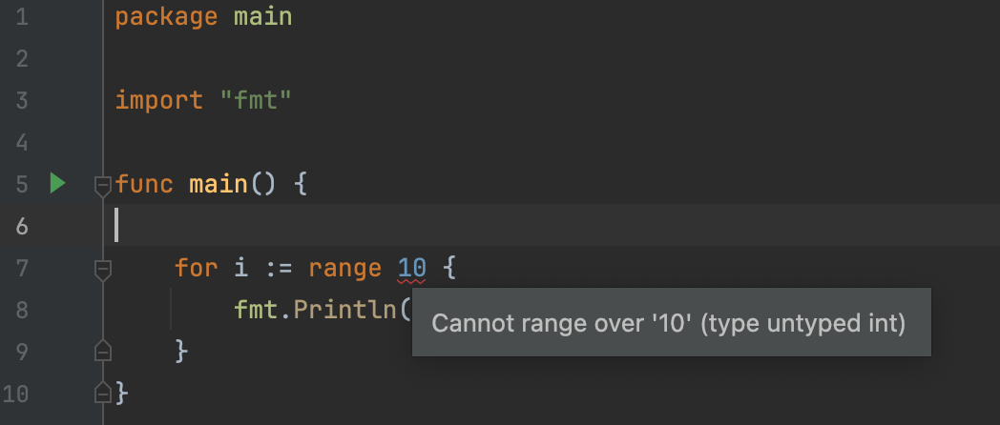

# Go 1.22 is released

Posted on Feb. 19, 2024

---

Go 1.22 在 2024 年 2 月 6 日发布了。

# 语言变化

## 循环里，变量不再是引用，而是一个值。

```go
package main

import "fmt"

func main() {
	done := make(chan bool)

	values := []string{"a", "b", "c"}
	for _, v := range values {
		go func() {
			fmt.Println(v)
			done <- true
		}()
	}

	// wait for all goroutines to complete before exiting
	for _ = range values {
		<-done
	}
}
```

我们看看 Go 1.22 和之前的版本有什么不同。

```text
➜  learn-20240219 go version
go version go1.22.0 darwin/arm64
➜  learn-20240219 go run main.go
c
a
b
➜  learn-20240219 gvm use go1.21
Now using version go1.21.0
➜  learn-20240219 go run main.go
c
c
c
➜  learn-20240219 go run main.go
c
c
c
```

很明显，Golang 1.22 里的循环里的变量，而是一个值；前序版本循环里的变量是引用，循环一遍之后，v 的值是最后一个元素。

## 整型也可以循环

```go
package main

import "fmt"

func main() {

	for i := range 10 {
		fmt.Println(i)
	}
}
```

在 Golang 前序版本 1.21 里，这段代码是不合法的。



在新版本里，可以正常循环输出。

```text
➜  learn-20240219 go version
go version go1.22.0 darwin/arm64
➜  learn-20240219 go run main.go
0
1
2
3
4
5
6
7
8
9
```

## 标准库更新

### 切片连接 slices.Concat

看看新版本和老版本连接 slice 的区别。

```go
package main

import "slices"

func main() {
	animals := []string{"cat", "dog", "bird"}
	fruits := []string{"apple", "banana", "orange"}

	// 1.22
	all := slices.Concat(animals, fruits)
	for _, v := range all {
		println(v)
	}

	// 1.22-, like 1.21
	all = append(animals, fruits...)
	for _, v := range all {
		println(v)
	}

}
```

运行效果是一样的，但是新版本的实现更简单。
```text
cat
dog
bird
apple
banana
orange
```

# 平台支持
官方文档里，有一章节叫「Ports」，我问了 ChatGPT，原来这个叫平台、操作系统。新版 Golang 1.22 提到了 `Loong64`，这个是中国开发的龙芯处理器。

```shell
Loong64
The loong64 port now supports passing function arguments and results using registers.

The linux/loong64 port now supports the address sanitizer, memory sanitizer, new-style linker relocations, and the plugin build mode.
```

# Reference
- https://go.dev/blog/go1.22
- https://go.dev/doc/go1.22
