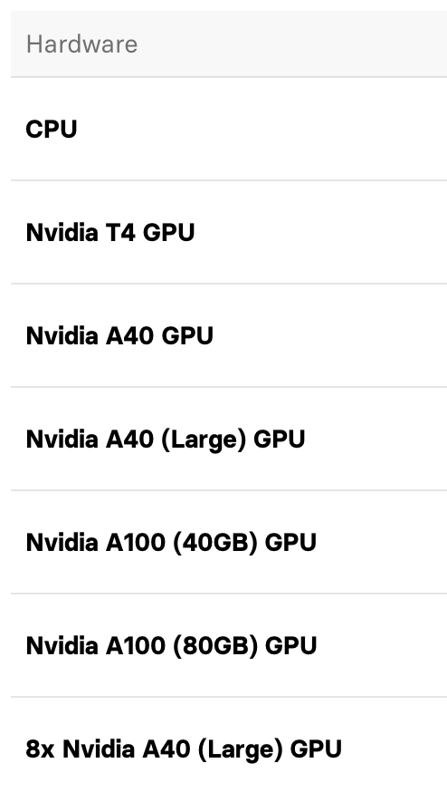

# AI changes voice

Posted on Jan. 27, 2024

---

There are so many ways to change the voice based on the tone of other people's voices.
- https://huggingface.co/PhoenixStormJr/RVC-V2-easy-gui-tutorial
- https://replicate.com/replicate/train-rvc-model/readme

## Some basic knowledge

- Famous GPU

[GPU used by replicate.com](https://replicate.com/pricing)

- epoch

An epoch is a term used in machine learning to describe one complete pass of the entire training dataset through the
learning algorithm. In other words, when all the data samples have been exposed to the neural network for learning
patterns, one epoch is said to be completed.
