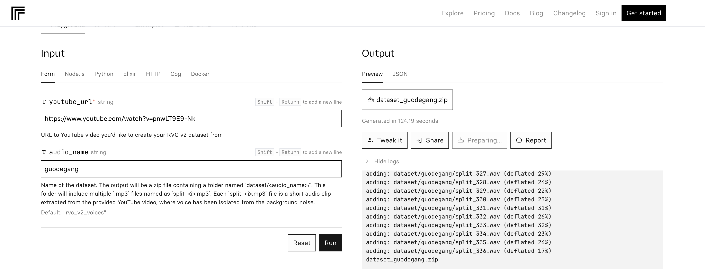

# AI changes voice

Posted on Jan. 27, 2024

---

There are so many ways to change the voice based on the tone of other people's voices.
- https://huggingface.co/PhoenixStormJr/RVC-V2-easy-gui-tutorial
- https://replicate.com/replicate/train-rvc-model/readme
- 

Retrieval-based Voice Conversion, or RVC for short, is a technology that can transform voices by applying the
characteristics of one voice to another. For example, you can make your voice sound like a celebrity, a cartoon character,
or a different gender. RVC uses a deep learning model that can learn from voice data with less than 10 minutes of
training.
It is also faster and more accurate than other voice conversion methods.

## Prepare the voice dataset

Follow the instruction [create-rvc-dataset](https://replicate.com/zsxkib/create-rvc-dataset) to prepare the voice dataset.
The input is a YouTube video, and the output is a dataset of audio segments.

I used a video from [郭德纲](https://www.youtube.com/watch?v=pnwLT9E9-Nk) as the input.

## Train the model

Follow the instruction [train-rvc-model](https://replicate.com/zsxkib/train-rvc-model) to train the model.

The trained model is available at [here](../resources/ai/model_guodegang.zip).

## Some basic knowledge

- Famous GPU

[GPU used by replicate.com](https://replicate.com/pricing)

- epoch

An epoch is a term used in machine learning to describe one complete pass of the entire training dataset through the
learning algorithm. In other words, when all the data samples have been exposed to the neural network for learning
patterns, one epoch is said to be completed.

