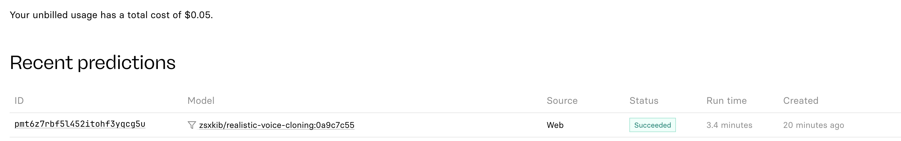
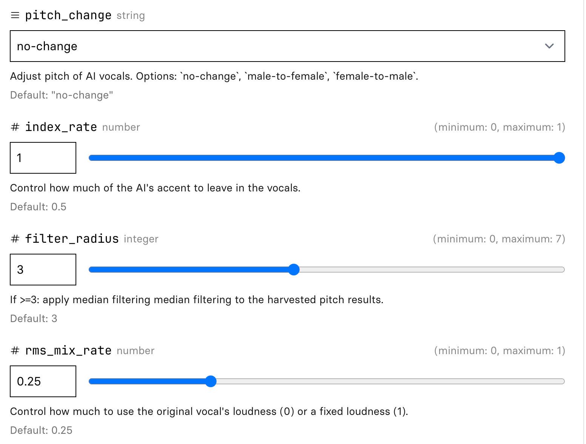
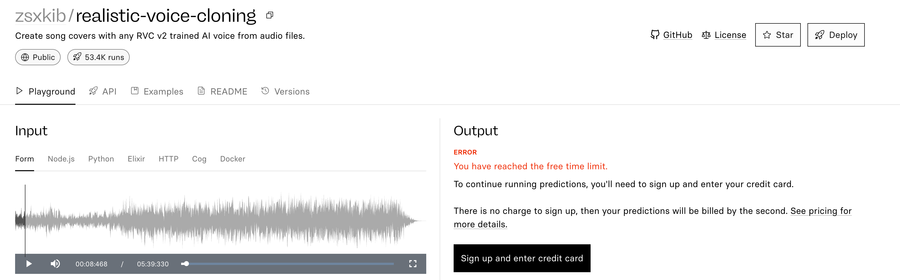

# 花 0.05 美元改变歌曲的声音

Posted on Feb. 1, 2024

---

在这篇文章中，我将使用AI（RVC模型）来改变声音：制作一首由其他人演唱的歌曲，而不是原来的歌手。
而且它非常便宜，转换费用仅为 0.05 美元。

## RVC 的一点介绍

基于检索的语音转换（Retrieval-based Voice Conversion，简称RVC）是一种通过应用检索技术来转换语音的技术。
一种声音对另一种声音的特征。 例如，您可以让您的声音听起来像名人、卡通人物、
或不同的性别。 RVC使用深度学习模型，可以在不到10分钟的时间内从语音数据中学习
训练。 它也比其他语音转换方法更快、更准确。

## 准备语音数据集

按照说明 [create-rvc-dataset](https://replicate.com/zsxkib/create-rvc-dataset) 准备语音数据集。
输入是 YouTube 视频，输出是音频片段的数据集。

我使用了 [郭德纲](https://www.youtube.com/watch?v=pnwLT9E9-Nk) 的视频作为输入，并获得了 .zip 格式的数据集。

## 训练模型

按照说明 [train-rvc-model](https://replicate.com/zsxkib/train-rvc-model) 训练模型。

训练好的模型可以在[此处](https://github.com/zzxwill/zhouzhengxi.com/raw/master/resources/ai/model_guodegang.zip)获得。

## 改变歌曲的声音

在提供的[工具](https://replicate.com/zsxkib/realistic-voice-cloning?prediction=7naznorbevvp4ba2oh3lkk5die)中，输入如下：

- 这首歌
  我使用了刘若音[后来](https://www.youtube.com/watch?v=t0igPuDjYUE)的歌曲并将其转换为.mp3。

- RVC模型

使用上面训练的模型。

有许多增强功能可供您调整输出。

例如，“index_rate”控制人工智能在声音中保留多少口音。

将歌曲的声音改为郭德纲需要几分钟，这里有[demo](../resources/ai/liuruoying_later_houlai_by_guodegang_more_ai.mp3)供您收听。

酷吗？

## 你可能遇到的问题

- 您已达到免费时间限制

培训很便宜，只需链接您的乐队帐户即可。 还支持银联银联。
