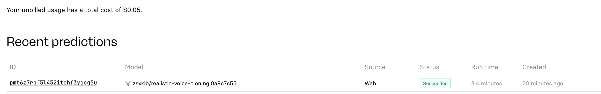
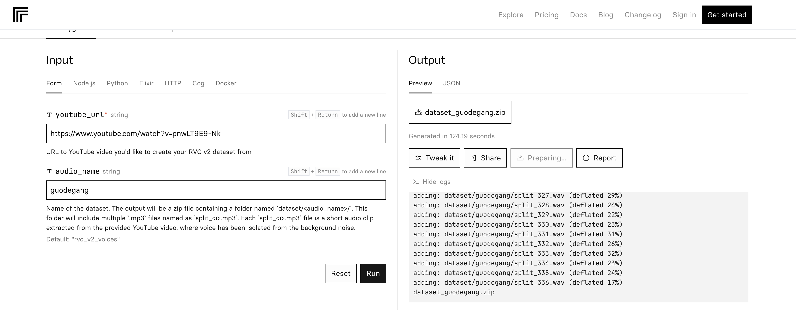
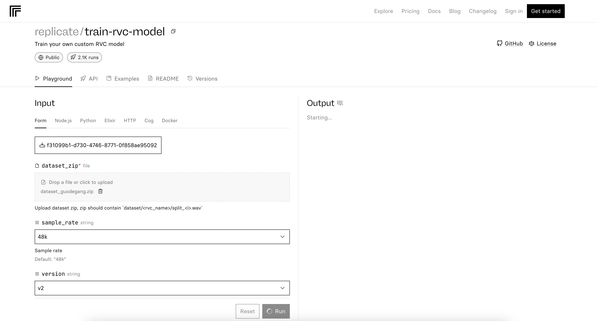
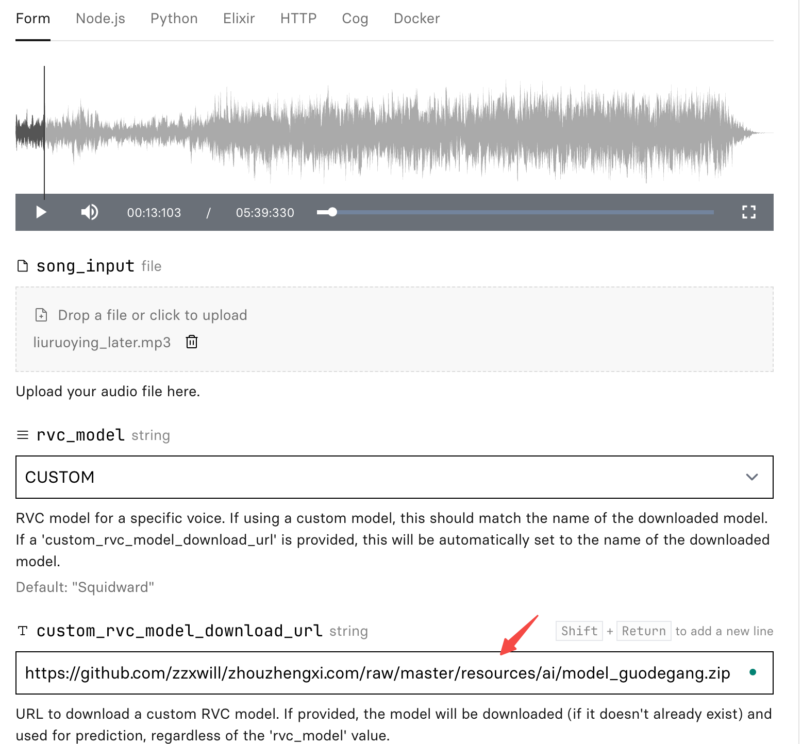
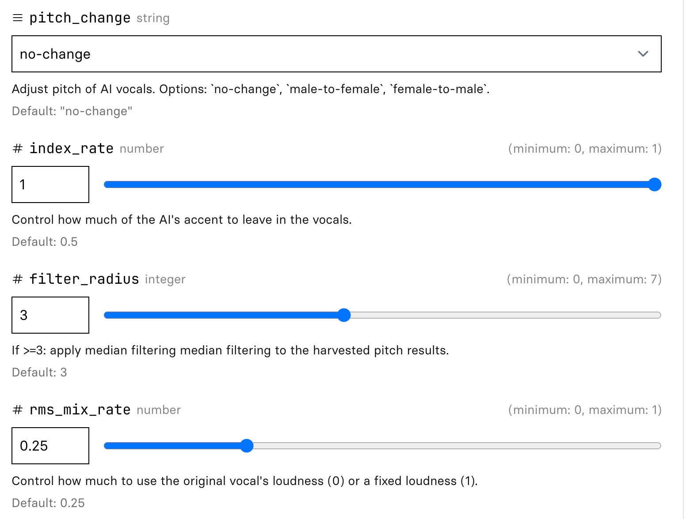
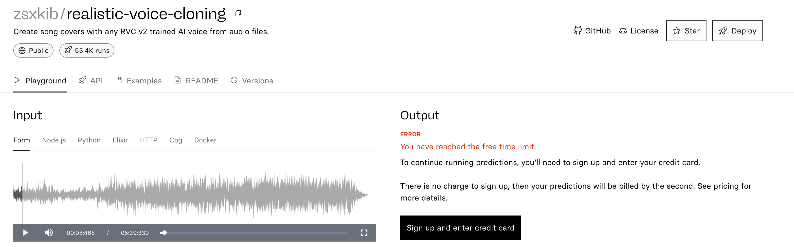

# Spend $0.05 to Change the Voice of a Song

Posted on Jan. 27, 2024

---

In this article, I will use AI (RVC model) to change voice: making a song sang by some one else, other than the orignal singer.
And it's pretty cheap, with only $0.05 for the conversion.

## A little bit of introduction to RVC

Retrieval-based Voice Conversion, or RVC for short, is a technology that can transform voices by applying the
characteristics of one voice to another. For example, you can make your voice sound like a celebrity, a cartoon character,
or a different gender. RVC uses a deep learning model that can learn from voice data with less than 10 minutes of
training. It is also faster and more accurate than other voice conversion methods.

## Prepare the voice dataset

Follow the instruction [create-rvc-dataset](https://replicate.com/zsxkib/create-rvc-dataset) to prepare the voice dataset.
The input is a YouTube video, and the output is a dataset of audio segments.

I used a video from [郭德纲](https://www.youtube.com/watch?v=pnwLT9E9-Nk) as the input, and I got the dataset in .zip format.

## Train the model

Follow the instruction [train-rvc-model](https://replicate.com/zsxkib/train-rvc-model) to train the model.

The trained model is available at [here](https://github.com/zzxwill/zhouzhengxi.com/raw/master/resources/ai/model_guodegang.zip).

## Change the voice of a song

In the [tool](https://replicate.com/zsxkib/realistic-voice-cloning?prediction=7naznorbevvp4ba2oh3lkk5die) provided, the inputs are as below:

- The song
I used a song from Liu Ruoyin [Later 后来](https://www.youtube.com/watch?v=t0igPuDjYUE) and converted it to .mp3.

- The RVC model

Use the model trained above.

The are many auguments for you to tune the output.

For example, `index_rate` controls how much of the AI's accent to leave in the vocals.

It will take a few minutes to change the voice of the song to 郭德纲, here is the [demo](../resources/ai/liuruoying_later_houlai_by_guodegang_more_ai.mp3) for you to listen to.

Is it cool?

## Problems you might hit

- You have reached the free time limit

The training is cheap, just link your band account. The UnionPay 银联 is also supported.

