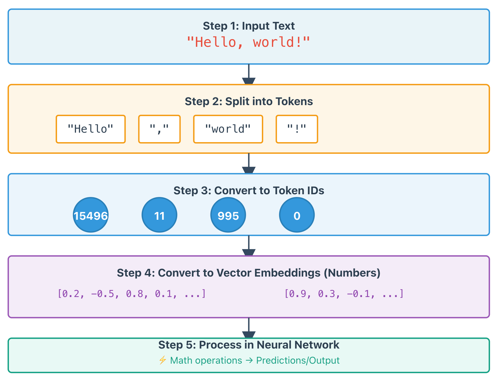

# Understanding Tokenizers in NLP

*A Q&A exploration of how tokenizers work in machine learning*

---

## What is a Tokenizer?

A **tokenizer** is a tool that breaks down text into smaller units called "tokens" that machine learning models can process. It's a crucial component in natural language processing (NLP).

### What tokenizers do:

**Text → Tokens → Numbers**

For example:
- Input: "Hello, world!"
- Tokens: ["Hello", ",", "world", "!"]
- Numbers: [15496, 11, 995, 0] (each token gets a unique ID)

### Why tokenizers are needed:

Machine learning models can't directly understand text—they work with numbers. Tokenizers bridge this gap by:

1. **Splitting text** into meaningful pieces (words, subwords, or characters)
2. **Converting** those pieces into numerical IDs
3. **Handling** special cases like punctuation, capitalization, and unknown words

### Types of tokenization:

- **Word-level**: "running" → ["running"]
- **Subword-level**: "running" → ["run", "##ning"] 
- **Character-level**: "hi" → ["h", "i"]

---

## Why Do Models Work with Numbers?

### Neural networks process numbers, not text

At their core, AI models are mathematical systems made of **neural networks**. They perform mathematical operations like:
- Addition and multiplication
- Matrix calculations
- Probability computations

These operations can only be done on **numbers**, not on letters or words.

### The problem:

A computer sees the word "cat" as just three letters. It has no way to mathematically process "c", "a", "t" directly.

### The solution - Converting text to numbers:

1. **"cat"** → gets ID **#5246** in the vocabulary
2. **#5246** → converted to a vector like **[0.2, -0.5, 0.8, 0.1, ...]** (hundreds or thousands of numbers)
3. These numbers are fed into the neural network
4. The network performs math: multiplies, adds, transforms these numbers through many layers
5. Output numbers → converted back to text or predictions

### Simple analogy:

Think of it like a calculator:
- ❌ You can't type "five plus three" and get an answer
- ✅ You must use **5 + 3** (numbers) to get **8**

Similarly:
- ❌ Neural networks can't process "The cat sat"
- ✅ They need **[245, 5246, 892]** → do math → produce results

That's why tokenizers are essential—they're the **translators** between human language (text) and machine language (numbers).

---

## Does Every Word Have an ID in the Vocabulary?

**No**, and this is actually a major challenge in NLP.

### The vocabulary size problem:

A tokenizer's vocabulary is **fixed and limited**—typically containing:
- 30,000 to 100,000+ tokens
- Only the most common words and subwords

But languages have:
- Millions of possible words
- New words constantly appearing (like "ChatGPT", "cryptocurrency", "selfie")
- Rare words, names, technical terms
- Typos and variations

### How tokenizers handle unknown words:

#### Old approach (word-level):
- Known word: "cat" → ID #5246 ✓
- Unknown word: "flibbertigibbet" → **[UNK]** token (unknown)
- **Problem**: Loses information!

#### Modern approach (subword tokenization):
This is what most current models use. They **break unknown words into smaller pieces**:

**Examples:**
- "cat" (common word) → [5246]
- "unbelievable" (maybe not in vocabulary) → ["un", "##believ", "##able"] → [342, 7891, 2156]
- Even made-up words work: "supercalifragilistic" → ["super", "##cal", "##if", "##rag", "##il", "##istic"]

### Why subword tokenization works:

Even if a model has never seen the word "unbelievable", it knows:
- "un" = negation prefix
- "believe" = concept it understands  
- "able" = capability suffix

So it can still understand the meaning!

---

## How Long is One Token?

**Token length is NOT fixed** and varies significantly depending on the tokenization algorithm and the specific word.

### Token length examples:

#### Short tokens (1-2 characters):
- "I" → 1 token (1 character)
- "##ing" → 1 token (subword suffix)
- "a" → 1 token

#### Medium tokens (whole common words):
- "cat" → 1 token (3 characters)
- "hello" → 1 token (5 characters)
- "running" → 1 token (7 characters) *if in vocabulary*

#### Long tokens or multiple tokens:
- "unbelievable" → might be **1 token** (12 characters) OR split into **3 tokens**: ["un", "##believ", "##able"]
- "supercalifragilistic" → probably **6-8 tokens** depending on the tokenizer

### General patterns:

- **Common words** → usually 1 token (any length)
- **Rare/new words** → split into multiple subword tokens
- **Spaces and punctuation** → often separate tokens

### Token count ≠ Word count:

"I don't know" = **3 words**

But might be tokenized as:
- **4 tokens**: ["I", "don", "'t", "know"]
- **5 tokens**: ["I", "do", "##n", "'t", "know"]
- **6 tokens**: ["I", "do", "#", "#n", "'", "t", "know"]

### Why this matters:

When you see **"token limits"** in AI models (like "8000 tokens" or "128k tokens"), it doesn't directly translate to a word count! 

- Roughly: **1 token ≈ 0.75 words** (English average)
- But this varies based on:
  - Language (Chinese uses more tokens per word)
  - Text complexity (technical terms use more tokens)
  - Specific tokenizer used

---

## Key Takeaways

1. **Tokenizers convert text into numbers** that neural networks can process mathematically
2. **Vocabularies are limited** and can't contain every possible word
3. **Subword tokenization** is the modern solution that breaks unknown words into meaningful pieces
4. **Token length is NOT fixed** — it varies from single characters to whole words depending on the tokenizer and word frequency
5. **Token count ≠ word count** — roughly 1 token ≈ 0.75 words, but this varies significantly
6. **Tokenizers are separate maintained components** in ML systems (like in Hugging Face) because they're sophisticated tools crucial for model performance

---

*This understanding helps explain why tokenizers appear as a distinct component in AI tool libraries, maintained separately alongside transformers, datasets, and other core components.*
