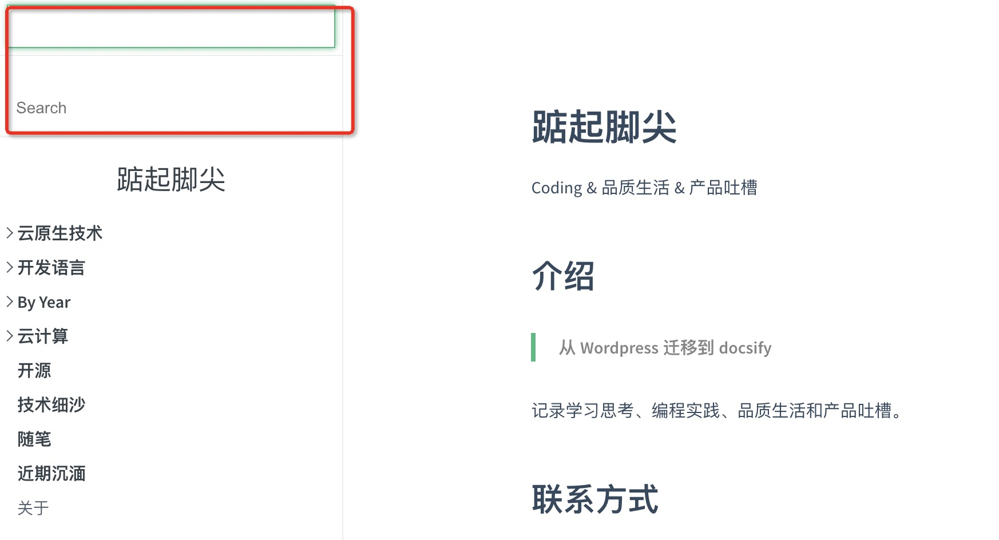

# How to develop this blog with docsify

[Docsify](https://docsify.js.org/) is a magical documentation site generator.

## Locally preview the site

```shell
➜  zhouzhengxi.com git:(master) docsify serve . --open

Serving /Users/zhouzhengxi/Programming/golang/src/github.com/zzxwill/zhouzhengxi.com now.
Listening at http://localhost:3000
```

## Plugins

These are the plugins which are used in this site.

- 折叠左侧菜单
  [docsify-sidebar-collapse](https://github.com/iPeng6/docsify-sidebar-collapse)
  
- 添加搜索
  ```
  search: {
        noData: {
          '/': 'No results!'
        },
        paths: 'auto',
        placeholder: {
          '/': 'Search'
        }
      },
  ```
  
  注释`<script src="//cdn.jsdelivr.net/npm/docsify/lib/docsify.min.js"></script>`;
  添加`<script src="//unpkg.com/docsify/lib/plugins/search.min.js"></script>`。
  
  如果不注释，左上角会出现两个搜索框。
  
  
- Share
  ```
  share: {
        facebook: true,
        twitter: true,
        telegram: true,
      },
  ```
  <script src="//unpkg.com/docsify-share/build/index.min.js"></script>

## Docsify tips
- 为文章添加日期
  [index.html](./index.html) 里添加日期格式：
  
  `formatUpdated: '{MM}/{DD}/{YYYY} {HH}:{mm}:{ss}',`

  在 Markdown 里通过 `{docsify-updated}` 使用，可以查看范例——[每天学一点-go-语言043-Getwd.md](./2021/每天学一点-go-语言043-Getwd.md)

  updated @2021.1.15
  这个方法是错误的，所有的时间都会被更新为最后一次 commit 的时间


- 页面无法滑动
  页面超出一屏，无法上线滑动，解决方法，参加 [issue](https://github.com/docsifyjs/docsify/issues/411)。
