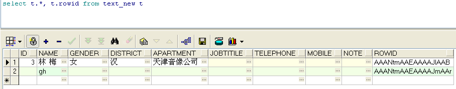
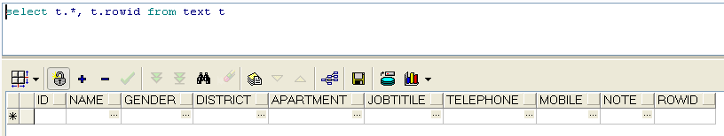
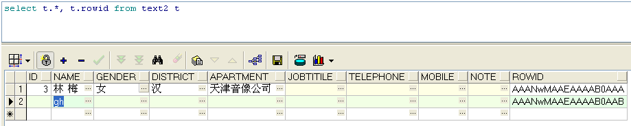

1. 建立一个与表B结构一样的A表（不包含B表数据或包含B表数据）

表B：

  

create table text nologging as

select \* from text\_new

where 1=2;

表A———不包含表B数据：

表A———包含表B数据：

\[sql\]create table text nologging as

select \* from text\_new\[/sql\]

