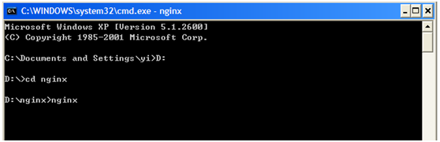

#### 简介

Nginx("engine x")是一个高性能的HTTP和反向代理服务器，也是一个IMAP/POP3/SMTP代理服务器。

#### 使用Nginx前必须了解的事项

- Nginx本身只是一个HTTP和反向代理服务器，它无法像Apache一样通过安装各种模式来支持不同的页面脚本，例如PHP,CGI等。
    
- Nginx支持简单的负载均衡和容错。
    
- 支持作为基本HTTP服务器的功能，例如日志、压缩、Bytes ranges、Chunked responses、SSL、虚拟主机等等，应有尽有。
    

#### 安装

- 下载Nginx：网址：[http://nginx.org/en/download.html](http://nginx.org/en/download.html)
    
- 下载到D盘，解压缩zip文件：
    
- 文件夹名字修改为nginx：
    
    
    
- 将conf目录下的nginx.conf文件，修改端口为8080，其他也可以，只是不要和其他服务端口重复：
    
    Nginx.conf文件：
    
    
    
- 打开cmd命令行：
    
    
    
- 打开浏览器，输入[http://localhost:8088](http://localhost:8088),看到如下网页：
    
    
