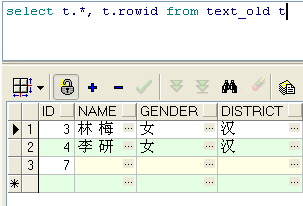
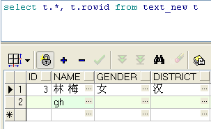
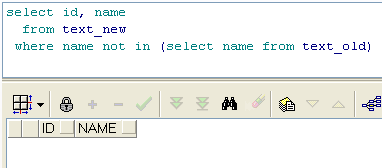
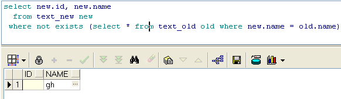
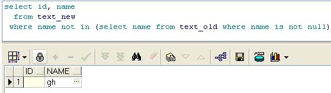

text\_old表

text\_new表

  

 

需求： 找出在text\_new表中而不在text\_old表（表中记录有空值）中的记录

结果一——使用in

 

结果二——使用exist

 

可以看到使用in查询的结果错误，而用exists查询的结果正确，这是为什么呢？

修改in语句，首先排除text\_old中的空值，然后查询

结果也正确。

 

那么是text\_old表中的空值在作怪，但具体是为什么呢？
