**配置**

菜单--》文件--》逆向工程--》Database...

在New Physical Data Model 窗口中，DBMS(Database Management System)选择 ORACLE 的版本

[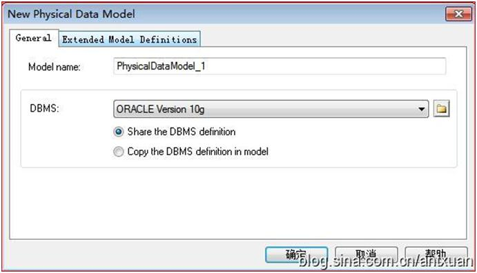](http://photo.blog.sina.com.cn/showpic.html)

在Database Recerse Engineering Options窗口中选择连接数据库的类型，这里选择 Using a data source

[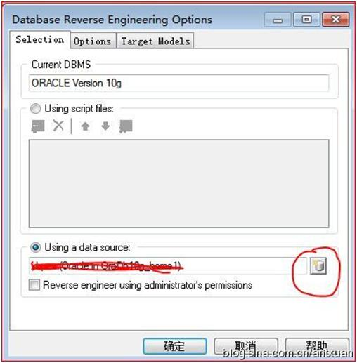](http://photo.blog.sina.com.cn/showpic.html)

点击Connect to a datasource 按钮

[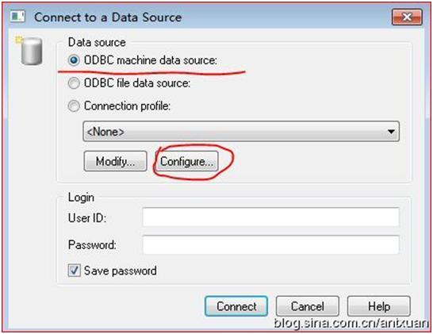](http://photo.blog.sina.com.cn/showpic.html)

选择ODBC machine data source 机器数据源

之后配置数据源

[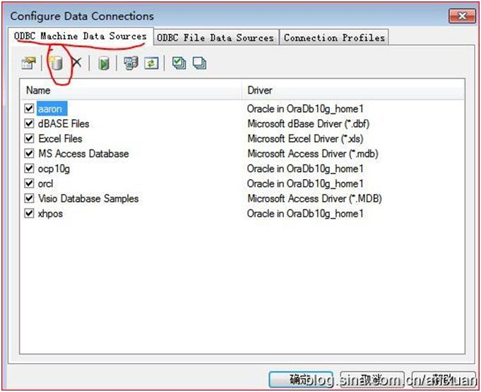](http://photo.blog.sina.com.cn/showpic.html)

点击下一步，数据源类型为默认的文件数据源

[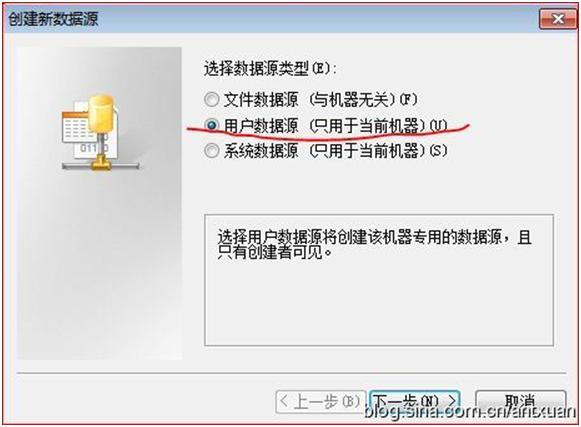](http://photo.blog.sina.com.cn/showpic.html)

选择驱动程序，oracle

[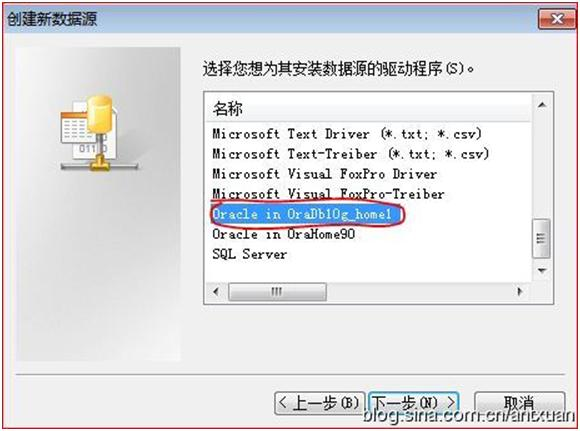](http://photo.blog.sina.com.cn/showpic.html)

下一步

[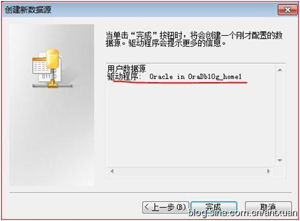](http://photo.blog.sina.com.cn/showpic.html)

完成数据源的配置

[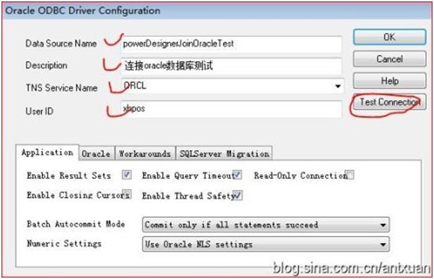](http://photo.blog.sina.com.cn/showpic.html) 

测试连接

[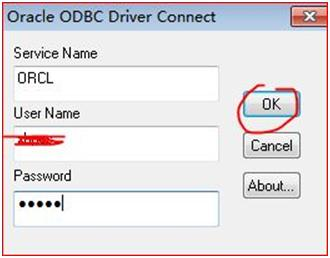](http://photo.blog.sina.com.cn/showpic.html)

测试OK，返回到主界面，选择数据源，输入用户名密码点击 Connect

 [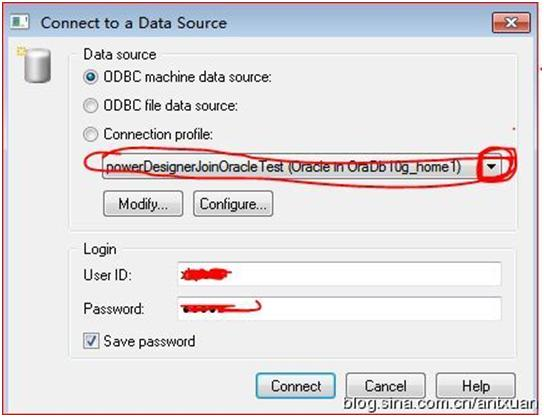](http://photo.blog.sina.com.cn/showpic.html) 

 之后选择表就可以了。如果表较多的话，时间会长点

 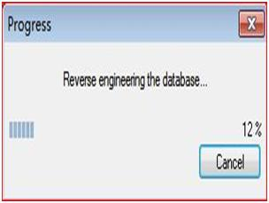 

**出现错误**

出现"unable to list the tables oracle odbc ora ora-00904 t dropped"说明oracle 的驱动版本选择错误。

参考自：

配置：[http://blog.sina.com.cn/s/blog\_59d6717c0100hrd7.html](http://blog.sina.com.cn/s/blog_59d6717c0100hrd7.html)

错误：[http://www.pfcguide.com/\_newsgroups/msgbody.asp?id=%3C4a5345c5.131b.1681692777%40sybase.com%3E&no=28697&group=sybase.public.powerdesigner.general](http://www.pfcguide.com/_newsgroups/msgbody.asp?id=%3C4a5345c5.131b.1681692777%40sybase.com%3E&no=28697&group=sybase.public.powerdesigner.general)
