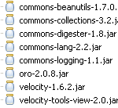

官方的wiki这样描述 Velocity:

> [Velocity](http://velocity.apache.org/) is a simple yet powerful Java-based template engine that renders data from plain Java objects to text, xml, email, SQL, Post Script, HTML etc. The template syntax and rendering engine are both easy to understand and quick to learn and implement.

也就是：

Velocity是一个简单，强大的，基于Java的模板引擎，它能从PJO将数据描述到 文本，xml, email, SQL, Post Script, HTML等。这种模板语法和表述引擎不仅易于理解，同时能很快的学习和实现。

本文以一个小项目Velocity4Freshman入门

# 准备工作

在Velocity官网上[http://velocity.apache.org/](http://velocity.apache.org/)下载相应的jar包，包括

 新建web project: Velocity4Freshman

- 导入下载的jar包。
- HelloWorld.java

很简单的java类

\[java\]public class HelloWorld {
	private String hello = "Hello Velocity!";

	public String getHello() {
		return hello;
	}
}\[/java\]

- 配置web.xml

> <web-app>
> 
>   <servlet>
> 
>     <servlet-name>velocity</servlet-name>
> 
>     <servlet-class>org.apache.velocity.tools.view.VelocityViewServlet</servlet-class>
> 
>   </servlet>
> 
>   <servlet-mapping>
> 
>     <servlet-name>velocity</servlet-name>
> 
>     <url-pattern>\*.vm</url-pattern>
> 
>   </servlet-mapping>
> 
>   <welcome-file-list>
> 
>     <welcome-file>test.vm</welcome-file>
> 
>   </welcome-file-list>
> 
> </web-app>

- 配置tools.xml

> <?xml version="1.0"?>
> 
> <tools>
> 
> <toolbox scope="request">
> 
> <tool key="helloworld" restrictTo="test\*" />
> 
> </toolbox>
> 
> </tools>

这个很关键。

class="HelloWorld": 这是刚才我们写的Java类

key="helloworld": 给Java类一个key,便于后面的.vm和.jsp文件使用。

- test.jsp

> <%@taglib prefix="velocity" uri="http://velocity.apache.org/velocity-view"%> <html> <body> <velocity:view> $helloworld.hello </velocity:view> </body> </html>

- test.vm

> <html>
> 
> <body>
> 
>  $helloworld.hello
> 
> </body>
> 
> </html>

注意：

$helloworld.hello

helloworld： tools.xml里的Java类对应的key

hello: 是Java类中变量。

# 运行

[http://10.5.110.252:8080/Velocity4Freshman/](http://10.5.110.252:8080/Velocity4Freshman/)

或[http://10.5.110.252:8080/Velocity4Freshman/test.jsp](http://10.5.110.252:8080/Velocity4Freshman/test.jsp)

结果：

输出

> Hello Velocity!

# 工程源码

[工程源代码Velocity4Freshman](http://vdisk.weibo.com/s/rBIF)
