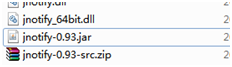

java本身不能直接监听系统的文件操作事件,但可以用第三方开源软件JNotify监控  
[_JNotify_ 可以在官网：](http://www.google.com.hk/url?sa=t&source=web&cd=1&ved=0CBkQFjAA&url=http%3A%2F%2Fjnotify.sourceforge.net%2F&rct=j&q=java%20Jnotify&ei=sVIETrHCJY_YiAKsh-HEDQ&usg=AFQjCNFe7HUf2D122XXPSQZ4Jr9JkroW8w&cad=rjt)[http://jnotify.sourceforge.net/](http://jnotify.sourceforge.net/)上去下载。  
1.下载成功后，把jnotify.dll放到system32（C:\\Windows\\System32）下面，不然就会报错Exception in thread "main" java.lang.UnsatisfiedLinkError: no jnotify in java.library.path

2\. 运行程序

**package** info.momoyi.test20120222;

**import** java.awt.EventQueue;

**import** java.awt.event.ActionEvent;

**import** java.awt.event.ActionListener;

**import** javax.swing.\*;

**import** javax.swing.border.EmptyBorder;

**import** net.contentobjects.jnotify.JNotify;

**import** net.contentobjects.jnotify.JNotifyListener;

**import** java.awt.\*;

**public** **class** MainFrame **extends** JFrame{

**private** JPanel contentPane;

**private** JTextField textField;

**private** JTextArea textArea;

**public** **static** **void** main(String\[\] args){

EventQueue._invokeLater_(**new** Runnable(){

**public** **void** run(){

**try**{

MainFrame frame =**new** MainFrame();

frame.setVisible(**true**);

}**catch** (Exception e){

e.printStackTrace();

}

}

});

}

**public** MainFrame(){

setDefaultCloseOperation(JFrame._EXIT\_ON\_CLOSE_);

setBounds(100, 100, 543, 300);

contentPane =**new** JPanel();

contentPane.setBorder(**new** EmptyBorder(5, 5, 5, 5));

setContentPane(contentPane);

contentPane.setLayout(**null**);

JLabel label =**new** JLabel("监控路径：");

label.setBounds(33, 20, 65, 15);

contentPane.add(label);

textField =**new** JTextField("D:/");

textField.setBounds(90, 16, 219, 21);

contentPane.add(textField);

textField.setColumns(10);

JButton button =**new** JButton("开始监控");

button.addActionListener(**new** ActionListener(){

**public** **void** actionPerformed(ActionEvent e){

**try**{

addWatch();

}**catch** (Exception ex){

ex.printStackTrace();

}

}

});

button.setBounds(319, 16, 93, 23);

contentPane.add(button);

textArea =**new** JTextArea();

JScrollPane scrollPane =**new** JScrollPane(textArea);

scrollPane.setBounds(33, 45, 480, 207);

contentPane.add(scrollPane);

}

**public** **void** addWatch() **throws** Exception{

String path = textField.getText();

**int** mask = JNotify._FILE\_CREATED_ | JNotify._FILE\_DELETED_

| JNotify._FILE\_MODIFIED_ | JNotify._FILE\_RENAMED_;

**boolean** watchSubtree =**true**;

//添加文件监听

**int** watchID = JNotify._addWatch_(path, mask, watchSubtree, **new** Listener());

}

**class** Listener **implements** JNotifyListener{

**public** **void** fileRenamed(**int** wd, String rootPath, String oldName,

String newName){

textArea.append("文件："\+ rootPath +" : "\+ oldName +" 重命名为： "

\+ newName +"\\n");

}

**public** **void** fileModified(**int** wd, String rootPath, String name){

textArea.append("文件修改 "\+ rootPath +" : "\+ name +"\\n");

}

**public** **void** fileDeleted(**int** wd, String rootPath, String name){

textArea.append("删除文件： "\+ rootPath +" : "\+ name +"\\n");

}

**public** **void** fileCreated(**int** wd, String rootPath, String name){

textArea.append("新建文件: "\+ rootPath +" : "\+ name +"\\n");

}

}

}

发现，能监测到指定文件下下文件的File created、File modified、File renamed、File deleted事件。

但是发现打开指定文件夹下的文件夹，也会输出"文件夹被修改的信息"，为什么呢？

注意：

在1里，如果，使用命令行来测试，jontify.dll也可以不放在system32下，可以通过\-Djava.library.path来指定.dll的路径。

C:\\Documents and Settings\\zhouzhengxi\\Desktop\\temp

\\jnotify-lib-0.93>java -Djava.library.path=. -jar jnotify-0.93.jar "c:\\Document

s and Settings\\zhouzhengxi\\Desktop\\temp\\"

解释：

1. \-Djava.library.path=.
    

它的jar会调用这个dll，那么这个dll应该放在哪里？  
需要了解的是，在启动程序的时候，dll的加载路径是存在一个叫「java.library.path」这样的JVM变量，  
（想知道java.library.path的默认值是什么，  
 System.out.println(System.getProperty("java.library.path"))  
 就能获得）  
可以发现，这个变量里含有c:\\windows\\system32，所以，一般来说，这个dll放到c:\\windows\\system32下就可以了，这显然不好。  
我们可以通过修改这个变量的值，来达到修改dll加载路径的目的。  
 -Djava.library.path=...

结果：

单击了c:\\Documents and Settings\\zhouzhengxi\\Desktop\\temp\\下siteadmin\\.htaccess文件，打印出：

modified C:\\Documents and Settings\\zhouzhengxi\\Desktop\\temp : siteadmin\\.htaccess

同样让人不可思议。

参考：

1. eldor测试试验后整理的资料
    
2. [http://blog.csdn.net/epinszteinic/article/details/4832921](http://blog.csdn.net/epinszteinic/article/details/4832921)
    
3. [http://xieruilin.iteye.com/blog/889889](http://xieruilin.iteye.com/blog/889889)
