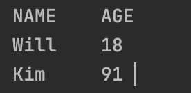

##### case-insensitive 字符串比较

strings.EqualFold("Go", "go")

##### 字符串拼接

<table class=""><tbody><tr><td>names := []<strong>string</strong>{"Will", "Karen", "Time"} fmt.Println(strings.Join(names, ", "))</td></tr></tbody></table>

## 格式化输出

### uitable

<table class=""><tbody><tr><td><strong>package</strong> main  <strong>import</strong> ( &nbsp; "fmt" &nbsp; "github.com/gosuri/uitable" )  <strong>type</strong> Student <strong>struct</strong> { &nbsp; Name <strong>string</strong> &nbsp; Age <strong>int</strong> }   <strong>func</strong> <strong>main</strong>() { &nbsp; names := []Student{ &nbsp; &nbsp; {Name: "Will", &nbsp; &nbsp; Age: 18}, &nbsp; {Name: "Kim", &nbsp; &nbsp; Age: 91}} &nbsp; table := uitable.New() &nbsp; table.MaxColWidth = 60 &nbsp; table.AddRow("NAME", "AGE") &nbsp; <strong>for</strong> _, n := <strong>range</strong> names { &nbsp; &nbsp; table.AddRow(n.Name, n.Age) &nbsp; } &nbsp; fmt.Println(table.String())  }  </td></tr></tbody></table>

今日份学习笔记：[https://docs.google.com/document/d/1G2\_YBa4hZA6huGzwFHNIiYPJ2qlCMZjmieNR\_WZoJaA/edit?usp=sharing](https://docs.google.com/document/d/1G2_YBa4hZA6huGzwFHNIiYPJ2qlCMZjmieNR_WZoJaA/edit?usp=sharing)
