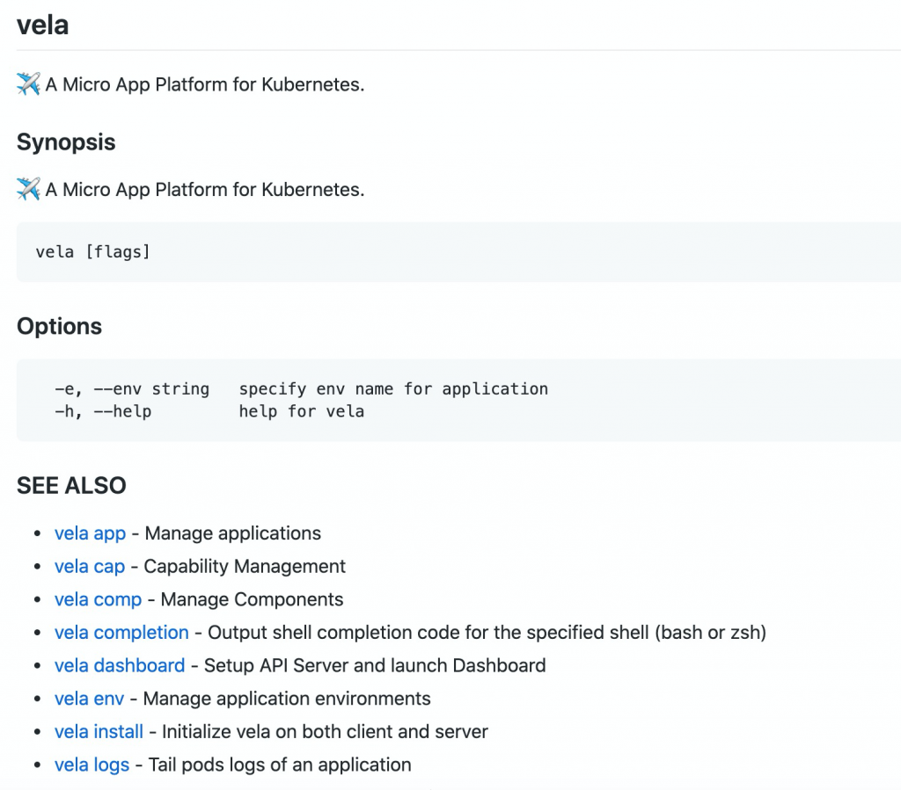

利用 cobra 内置 doc 库可以非常方便的生成 markdown CLI 文档。

doc.GenMarkdownTree(cmd, "/tmp")

效果参见：

[https://github.com/oam-dev/kubevela/blob/master/documentation/cli/vela.md](https://github.com/oam-dev/kubevela/blob/master/documentation/cli/vela.md)

